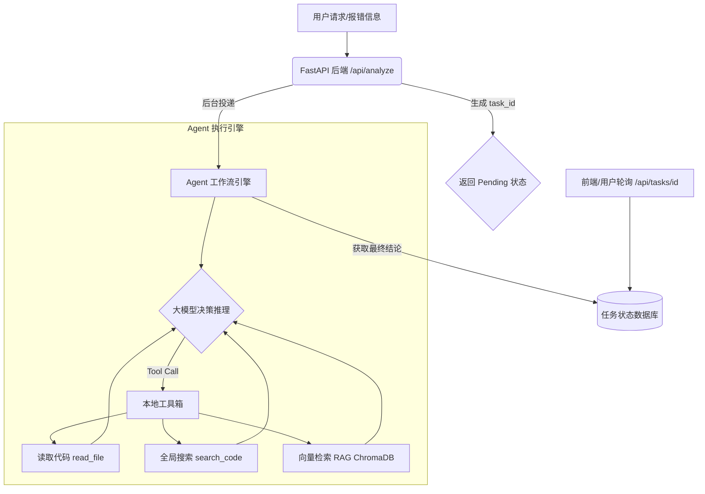

# AgentLearning Demo 集合

本目录包含了一系列循序渐进的 Python 脚本，对应 `docs/` 目录中的核心教程。这些 Demo 旨在帮助您以“极简”的方式快速跑通大模型 API 调用、Tool Calling、RAG、Agent 工作流以及后端工程化的全链路。

## 环境要求

请确保您已经在项目根目录配置了正确的虚拟环境，并安装了所有依赖。本项目的依赖统一使用 `uv` 管理。

```bash
# 进入项目根目录
cd AgentLearning

# 确保按照 pyproject.toml 安装了依赖
uv pip install -e .

# 配置环境变量（请在根目录创建 .env 文件）
# OPENAI_API_KEY="sk-..."
# OPENAI_BASE_URL="..."
# MODEL_NAME="gpt-4o-mini"
```

## 目录结构与演示内容

| 文件名 | 对应教程 | 核心知识点 |
| --- | --- | --- |
| `demo01_llm_api.py` | `1. LLM API 调用.md` | OpenAI SDK 的基本调用、Pydantic 结构化输出(Structured Outputs)、System Prompt 设置。 |
| `demo02_tool_calling.py` | `2. Tool Calling.md` | 工具描述 (Function Calling)、请求工具、在后端执行真实的 Mock 函数，并回传 Observation 给模型。 |
| `demo03_rag_basics.py` | `3. RAG 基础.md` | 使用 LangChain 读取本地代码文件、切分 (Chunking) 并存入 ChromaDB 向量数据库，最后检索 Top-K 结合 LLM 生成回答。 |
| `demo04_agent_workflow.py`| `4. Agent 工作流.md` | 手写一个简单的带有 `MAX_STEPS` 限制的 ReAct 循环，让模型自我决定调用工具收集线索。 |
| `demo05_engineering_backend.py`| `5. 工程后端化.md` | 使用 FastAPI 提供对外的 API 接口，并使用 `BackgroundTasks` 在后台处理长耗时的 Agent 循环，模拟生产环境下的轮询。 |

## 系统架构图：从脚本到工程化



## 运行指南

所有脚本均需要使用虚拟环境运行，以下命令假设您在项目根目录下：

```bash
# 运行 Demo 1: 结构化解析
uv run python demo/demo01_llm_api.py

# 运行 Demo 2: 工具调用
uv run python demo/demo02_tool_calling.py

# 运行 Demo 3: RAG 基础检索
uv run python demo/demo03_rag_basics.py

# 运行 Demo 4: Agent 循环
uv run python demo/demo04_agent_workflow.py

# 运行 Demo 5: 启动 FastAPI 后端服务
uv run uvicorn demo.demo05_engineering_backend:app --reload
```

> **Tip**: 运行 FastAPI 后，可以在浏览器中访问 `http://127.0.0.1:8000/docs` 查看并测试自动生成的 Swagger 交互式 API 文档。
