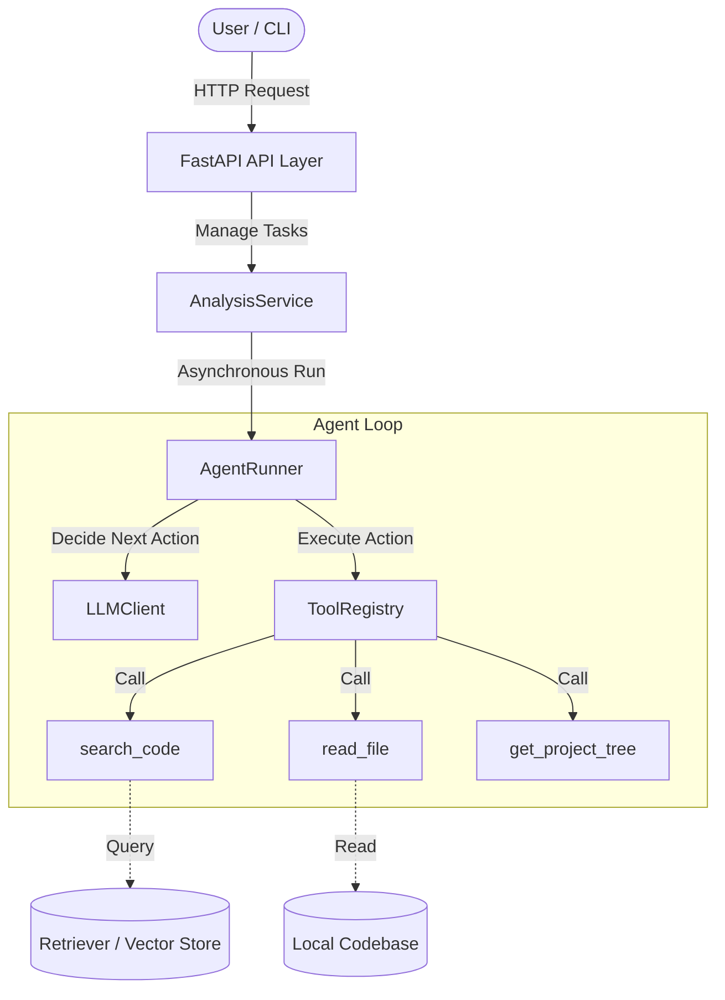
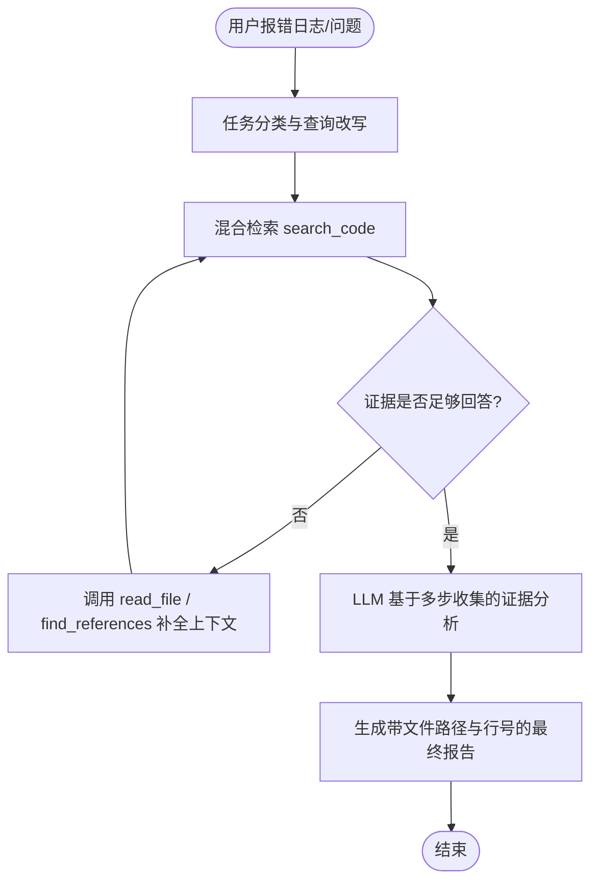

前面五块是能力本身：
- **LLM API 调用**
- **Tool Calling**
- **RAG**
- **Agent 工作流**
- **工程后端化**

但求职还有一个非常现实的问题：你做了项目，不等于面试官能看懂；面试官看懂了，也不等于他相信你真的掌握了。

尤其如果你在开发过程中借助了 Claude Code / Codex 等 AI 工具辅助，你更需要做好项目表达，否则面试官很容易觉得：“这个项目看起来挺完整，但候选人可能只是让 AI 一键生成的，自己并不理解。”

所以第 6 块就是：**如何把项目包装成一个可信、清晰、能讲、能问、能展示的求职项目**。

---

## 一、项目表达的目标是什么？

不是让项目看起来“很炫”，而是让面试官在 10 秒内快速理解以下四件事：
1. **你做的项目解决了什么具体问题？**（项目背景与痛点）
2. **这个项目的整体技术架构和数据流是什么？**（技术链路）
3. **哪些地方是你真正理解、重构和精心设计过的？**（技术亮点）
4. **这个项目和网上泛滥的普通问答 demo 套壳有什么区别？**（工程深度差异）

> [!CAUTION]
> **避免泛泛而谈的表达**：
> *“我做了一个基于大模型的智能体项目，支持 RAG、工具调用、多轮对话和代码分析。”* —— 这句话太泛了，没有任何记忆点。
> 
> **推荐具体而有亮点的表达**：
> *“我做了一个面向代码仓库理解的 Agentic RAG 系统。用户输入代码问题或报错日志后，系统会首先通过混合检索匹配代码片段，随后由 Agent 决策引擎调用 read_file、get_project_tree 等工具多步收集上下文证据，最后基于文件路径和精确行号生成可追溯、可验证的分析报告。项目重点解决的是传统 RAG 方案在代码仓库场景中召回不完整、幻觉严重和结果不可追溯的工程痛点。”*

---

## 二、README：不是说明书，而是你的项目简历

求职项目的 [README.md](file:///f:/VScode%20Workspace/Python_workspace/AgentLearning/README.md) 应该像一个产品宣传页 + 技术白皮书 + 面试讲稿的结合体。

一个合格的 README 应当包含以下几部分：
1. **项目一句话定位**（What, Who, Why, How）
2. **项目背景与痛点解决**
3. **核心功能亮点**
4. **技术架构图**
5. **核心业务工作流图**
6. **快速开始（支持 Docker 一键启动）**
7. **API 接口调用与输出示例**
8. **Demo 截图或 GIF 动图**
9. **项目目录结构与工程分层**
10. **未来规划 (Roadmap)**

---

## 三、架构图：项目一定要有图

README 里必须包含系统架构图。使用 Mermaid 语法是最佳实践，因为 GitHub 原生支持渲染，而且便于修改维护。



---

## 四、核心闭环图：体现 Agent 的多步决策逻辑

架构图展示“系统有哪些静态模块”，而**核心闭环图**则向面试官说明“系统是如何动态运行的”。这是证明你真正理解 Agent 工作流的有力证据。



---

## 五、接口规范：用代码展示你的工程素养

你是后端转 Agent，所以接口设计是你天然的优势。在 README 中贴出规范的 API 格式：

### 提交分析任务
- **请求方法**：`POST /api/v1/analyze`
- **请求体 (JSON)**：
  ```json
  {
    "repo_path": "/path/to/repo",
    "question": "运行项目时报 ModuleNotFoundError: No module named 'repomind'"
  }
  ```
- **响应体 (JSON)**：
  ```json
  {
    "task_id": "task_001",
    "status": "completed",
    "answer": "问题可能与 src layout 下包路径未正确安装有关。建议先执行 pip install -e . ...",
    "evidence": [
      {
        "file_path": "pyproject.toml",
        "start_line": 1,
        "end_line": 36,
        "reason": "检查包管理与安装配置"
      }
    ]
  }
  ```

---

## 六、项目目录结构：体现后端工程分层

在 README 中罗列出清晰的目录分层结构，并标明每个文件夹的职责，以体现你的高内聚低耦合设计思想。

```text
src/repomind/
├── api/                 # FastAPI 路由与接口定义
├── agent/               # AgentRunner 引擎、状态机 state 与 Prompt 模板
├── tools/               # 工具接口定义与安全执行逻辑 (ToolRegistry)
├── rag/                 # 文档加载、切块策略与向量/关键词检索器
├── llm/                 # 统一模型客户端封装 (LLMClient)
├── services/            # 核心业务处理服务层
├── storage/             # SQLite 任务状态与历史步骤持久化存储
└── core/                # 全局配置、异常处理与日志管理
```

> **面试答话术**：
> “我将系统划分为 API 层、Service 层、AgentRunner 引擎、ToolRegistry、Retriever 和 LLMClient。API 层负责快进快出，Runner 负责异步状态机调度，Registry 负责安全边界和入参校验，LLMClient 统一封装网络抖动重试和降级。这样的分层设计极大地降低了各组件耦合度，便于团队协作和模型更换。”

---

## 七、简历技术亮点怎么写？

不要在简历上堆砌纯技术栈（例如“精通 LangChain、Chroma”），而是要写成**“我通过什么技术解决了什么工程问题，取得了什么结果”**。

```text
【简历项目亮点写法示例】
1. 设计并实现基于 ReAct 状态机的代码仓库理解 Agent，支持自动分析报错日志，通过多步工具调用动态收集代码库上下文并生成可验证报告。
2. 构建面向代码场景的 Hybrid Retrieval（混合检索）管道，结合精准符号匹配与向量语义搜索，保证代码实体检索的准确性。
3. 封装具备鲁棒性设计的统一 LLMClient，在后端引入指数退避重试、断路器熔断和备用模型 Fallback 切换，服务高可用性得到有效保障。
4. 设计 ToolRegistry 机制，支持入参自动校验和基于 pathlib 的路径穿越防御，保障 Agent 执行系统命令与读取文件的安全性。
5. 采用 FastAPI 构建异步任务服务，支持任务状态持久化存储、步骤轨迹实时推送，并提供 Docker 一键部署配置。
```

---

## 八、面试 2 分钟项目自述模板

你可以这样向面试官介绍你的项目：

> “我这个项目叫 **RepoMind**，定位是一个**面向代码仓库理解与报错定位的 Agentic RAG 系统**。
> 
> 它解决的核心痛点是：开发者在面对复杂仓库报错时，通常需要手动频繁检索文件、对照配置并梳理调用链，十分耗时；直接交给 LLM 又容易因为缺少代码上下文产生严重幻觉。
> 
> 在流程上，RepoMind 接收到报错日志后，会先进行任务分类和 Query 改写，通过混合检索召回核心代码。若分析中发现证据不足，AgentRunner 决策引擎会动态调用文件读取和调用链追踪工具收集关联上下文。最后 LLM 基于这些真实的代码证据，输出一份包含根因、修补建议以及精确到文件路径和行号的报告。
> 
> 在工程设计上，我遵循后端分层规范，设计了 API 层、Service 业务层、Runner 执行引擎、ToolRegistry 工具安全校验器和统一 LLM 客户端。
> 
> 我做这个项目主要想体现两个核心工程能力：一是我深入理解了 RAG 和 Agent 工作流的闭环与边界；二是我有能力将 AI 原型打磨成一个稳定、安全、可追踪且支持 Docker 一键部署的后端服务。”

---

## 九、面试高频追问与标准回答

### 1. 你的项目和 Claude Code、Codex 有什么区别？
- **回答**：通用代码智能体（如 Claude Code）目标是代替程序员自动写代码，而 RepoMind 的定位是**垂直的代码仓库分析与可验证证据报告生成工具**。我们重点解决的是：第一，可追溯性，要求每一个分析结论必须关联到具体文件和代码行号；第二，安全性与受控性，将工具限制在只读检索和局部验证，而非让模型自由重写系统，更适合企业内嵌或作为后端微服务运行。

### 2. 哪些部分是你自己写的，哪些是 AI 自动生成的？
- **回答**：在开发中我确实使用了 AI 工具来辅助生成部分脚手架代码、测试用例和重构部分模块，这提高了我的开发效率。但是，**系统架构的设计、工具调用安全边界（如路径防穿越校验）、异步任务状态机流转逻辑（AgentRunner 核心 while 循环）以及整体的工程分层设计**，全都是由我主导、回读并经过重构的。

### 3. RAG 在代码场景为什么容易失败？你做了什么优化？
- **回答**：代码 RAG 常见失败原因有：切块生硬导致类和函数定义不完整；向量搜索对精确符号（如 `UserService`）匹配能力弱；召回噪声多干扰模型。我们的优化方案是：使用基于 AST 的 Chunking，按类/函数结构切分；采用 Hybrid Search，将 BM25 精确匹配与向量检索融合；引入 Rerank 机制对召回的 Top-20 进行重排序；最终在 Prompt 里强约束模型必须输出引用，且无证据时不瞎答。

### 4. Agent 怎么防止无限循环和失控？
- **回答**：主要依靠四层防线：
  1. **步数熔断**：设置 `MAX_STEPS = 6`。
  2. **重复过滤**：记录历史工具入参，相同工具和参数不重复执行。
  3. **证据自评估**：每一步让模型评估证据充分度，足够即输出 Final Answer 提前退出。
  4. **超时与网络重试上限**：在 LLMClient 中限制接口异常捕获和最大重试。

### 5. 如何保证 Agent 运行时的安全？
- **回答**：模型只生成参数，不直接操作底层系统。后端在 `ToolRegistry` 执行工具前会进行校验。比如对于 `read_file` 工具，我们使用 `Path.resolve()` 计算绝对路径，强制拦截不属于项目根目录前缀的非法路径，防御路径穿越。对于生成 patch 并运行测试这类写操作，采用任务挂起、SSE 实时推送到前端等待用户手动授权的机制。

---

## 十、你现在最该补齐的项目资产（优先级清单）

### P0 级（直接影响投递和第一眼印象）
1. [README.md](file:///f:/VScode%20Workspace/Python_workspace/AgentLearning/README.md) 顶部的清晰一句话定位与 Why RepoMind 痛点阐述。
2. 使用 Mermaid 画好**系统架构图**与**核心闭环图**并放入 README。
3. 补充 `快速启动` 章节，提供完整的 Docker 部署指令。
4. 整理出简历上的项目描述。
5. 练习熟读 2 分钟项目自述。

### P1 级（明显提升项目可信度）
1. 准备 API Swagger 文档页面截图。
2. 准备一两个典型分析任务的输入输出运行日志截图。
3. 补充 `.env.example` 和 Dockerfile 配置。

---

## 十一、这一块最该记住的一句话

> **项目表达的本质，是把“我做了一个 AI demo”的模糊陈述，转变为“我针对特定问题完成了系统级设计，进行了技术取舍，并以规范的工程手段实现了落地”。**