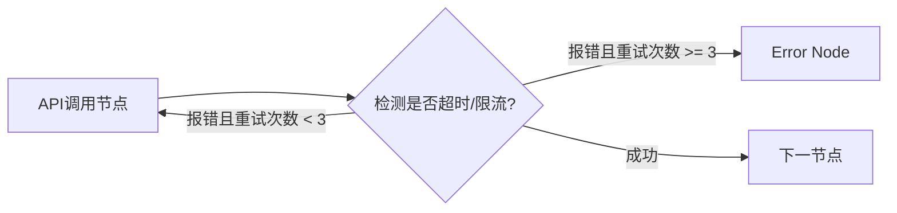
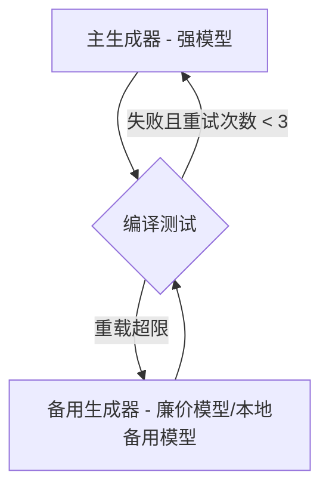
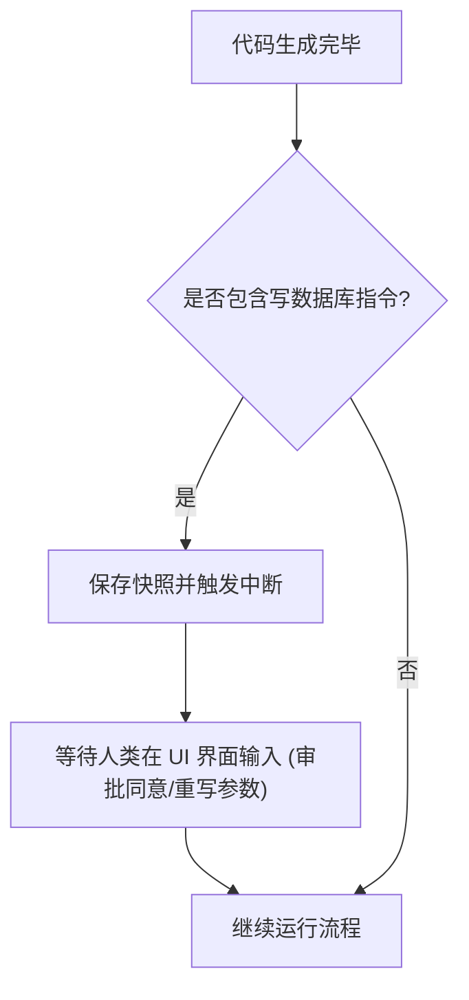

# Agent 编排与状态管理知识手册

本手册专门探讨基于图结构（以 LangGraph 为核心）进行复杂 Agent 工作流编排和状态管理的技术实现。涵盖了有环图设计、State 的 Reducer 机制、精细化节点划分、Retry/Fallback/Human-in-the-loop 控制边拓扑、状态防膨胀设计，以及端到端的集成测试与 Checkpoint 故障恢复方案。

---

## 📋 目录
- [一、 LangGraph 核心机制与优势 (Q1-Q6)](#一-langgraph-核心机制与优势-q1-q6)
- [二、 状态模型设计与节点细粒度划分 (Q7-Q11)](#二-状态模型设计与节点细粒度划分-q7-q11)
- [三、 节点类型选型与高级 Edge 流转模式 (Q12-Q20)](#三-节点类型选型与高级-edge-流转模式-q12-q20)
- [四、 复杂图简化与状态防膨胀策略 (Q21-Q22)](#四-复杂图简化与状态防膨胀策略-q21-q22)
- [五、 Checkpoint、故障恢复与测试评估 (Q23-Q30)](#五-checkpoint故障恢复与测试评估-q23-q30)

---

## 一、 LangGraph 核心机制与优势 (Q1-Q6)

### Q1: 为什么用 LangGraph？
1. **原生支持循环拓扑（Cyclic Graphs）**：传统的有向无环图（DAG）引擎无法有效处理 Agent 流程中频繁出现的“生成-测试-反思-修复”的循环流。LangGraph 原生支持定义环状结构，这在 ReAct、自我纠正工作流中是基础能力。
2. **全局状态机管理（State Management）**：图中的状态作为一等公民在整个运行时自动流转，支持并发节点执行时的状态自动合并与防冲突机制。
3. **断点持久化与 Human-in-the-loop**：内置图级别的 Checkpointer 支持，在任意节点执行完毕后自动持久化当前快照。这为实现人工审批修改、回滚和系统崩溃中断恢复提供了底层保障。

---

### Q2: 为什么不用普通 LangChain Agent？
普通的 LangChain Agent 架构（如 `ZeroShotAgent`、`StructuredChatAgent`）是高度封装的“黑盒系统”：
- **痛点**：
  1. **控制权完全交给大模型**：大模型需要独立推理下一步调用什么工具、何时退出。在遇到复杂业务场景时，极易陷入失控或死循环，无法引入强确定性的硬编码业务规则。
  2. **难以控制工具调用顺序**：无法强制规定“在运行工具 B 之前，必须先通过工具 A 获取权限校验”。
  3. **可解释性与调试困难**：由于整个交互历史混杂在单次对话历史中，开发者极难对各个独立的子任务执行流做隔离排查。
- **LangGraph 的破局**：将原本黑盒的 Agent 拆解为白盒状态图，将决策流与控制权部分收归给确定性的代码（图路由和边），在大模型的灵活性与系统的确定性之间实现完美平衡。

---

### Q3: LangGraph 的 State 是什么？
**State（状态）** 是定义在图结构运行周期内的全局状态字典或类（通常使用 Python 的 `TypedDict` 或 Pydantic 定义）。它记录了图内所有节点可读写的共享数据。

#### 🧪 Reducer（状态合并机制）
这是 State 的灵魂。默认情况下，如果两个节点返回了相同的 key，新数据会直接覆盖旧数据。但在 RAG 和 Agent 系统中，我们通常需要增量记录（例如往对话历史追加消息）。
通过为字段配置 Reducer 函数（如 `add_messages`），可以规定状态更新的行为是追加、合并还是按 ID 更新。

##### 💻 典型定义：
```python
from typing import Annotated, TypedDict
from langchain_core.messages import BaseMessage
from langgraph.graph.message import add_messages

class AgentState(TypedDict):
    # messages 字段被标记了 add_messages 状态合并机制。
    # 任何节点返回的 messages 会被追加或基于 ID 合并到此列表，而非覆盖。
    messages: Annotated[list[BaseMessage], add_messages]
    # 普通状态，新值直接覆盖旧值
    compiled_code: str
    step_counter: int
```

---

### Q4: LangGraph 的 Node 是什么？
**Node（节点）** 是图结构中的计算单元。在代码层面，它表现为一个接收当前图的全局 `State` 作为输入，并返回一个 `Dict` 用于更新 `State` 对应字段的 Python 函数（同步或异步皆可）。
- **设计规范**：Node 应被设计为**无副作用**的纯函数，它们不应擅自直接去修改全局变量，所有的状态更新都必须通过 `return` 字典的显式方式上报，由 LangGraph 的 State 引擎统一完成。

---

### Q5: LangGraph 的 Edge 是什么？
**Edge（边）** 定义了节点之间的跳转逻辑与连接规则。
1. **普通边 (Normal Edge)**：确定性的单向跳转。例如 `workflow.add_edge("generate_code", "test_code")`，表示 `generate_code` 节点执行完毕后，执行流百分百流入 `test_code`。
2. **条件边 (Conditional Edge)**：根据条件决策函数（Router Function）返回的字符串，动态路由到下一个不同的目标节点。

---

### Q6: Conditional Edge 有什么用？
条件边是实现 Agent 自主决策与系统异常控制的关键：
- **工具流分发**：检查大模型最新输出的消息，若包含 `tool_calls` 则路由至 `tool_executor` 节点；若无则路由至回答生成节点。
- **质量自愈循环**：检查测试用例是否报错，若有报错路由至 `code_fixer` 节点重试；若通过则流向 `deploy` 节点。
- **硬性熔断控制**：检查 `state.step_counter` 是否达到最大限制，若是则路由至 `error_handler`。

---

## 二、 状态模型设计与节点细粒度划分 (Q7-Q11)

### Q7: State 里应该存什么？
1. **全局对话历史与推理链路 (Message History)**：由 Reducer 维护的会话记录，供大模型获取上下文。
2. **阶段性核心交付物**：如当前步骤生成的 `draft_text`、编译生成的 `executable_path` 等业务状态。
3. **系统预算与统计度量**：记录 `step_counter`（步骤计数）、`token_usage`（已消耗 Token 数）、`tool_call_history`。
4. **权限与环境上下文**：当前用户的会话 ID、安全等级、租户 ID 等元数据。

---

### Q8: State 里不应该存什么？
1. **局部辅助控制变量**：某个 Node 内部的辅助局部变量（如 for 循环的 `idx`）不应该上升到全局 State，防止状态层级污染。
2. **不可反序列化的对象实例**：如**打开的数据库连接（DB Connections）、活跃的 Socket 套接字、文件描述符、网络 Session 句柄**。State 必须能够随时被 JSON 序列化并持久化，存入这些对象会导致 Checkpointer 在快照存储时发生致命异常。
3. **未脱敏的用户密钥与敏感明文数据**。

---

### Q9: Node 应该设计得粗还是细？
**推荐设计得越“细”越好（Fine-grained Nodes）**。
- **细粒度节点的优势**：
  1. **极佳的可调试性与单元测试**：节点职责单一（例如一个节点只做“校验 JSON 是否合规”），非常易于为其编写单体测试。
  2. **细粒度 Checkpoint 记录**：每执行完一个细粒度节点，状态就会被持久化一次。如果系统在中途崩溃，可以最大程度从最邻近的崩溃点恢复，减少重复的大模型 API 调用。
  3. **Trace 清晰**：在可视化监控后台中，各子任务的输入、耗时与输出一目了然。

---

### Q10: 一个 Node 里能不能同时做检索和生成？
- **强烈反对**。
  如果检索与生成耦合在同一个节点，这会导致该节点的 Prompt 极其复杂且容易发生冲突。此外，你将无法在这两个阶段之间加入精细化的控制，例如：
  - 无法对检索到的内容进行中间人工审查与过滤（Human-in-the-loop）。
  - 无法在中间引入 Reranker 模型进行独立重排序。
  - 降低了模块的可复用度。

---

### Q11: Edge 判断逻辑应该由代码写还是由模型判断？
- **黄金法则：凡是能用确定性代码（如正则、布尔条件断言、状态码检查）做出的路由判断，绝对不要交给大模型。**
- 大模型的判定是不确定且带有延迟和成本的。
- *反例*：把工具调用报错扔给大模型，问它：“你看刚才执行出错了没？有错帮我走向修复节点”。
- *正例*：直接使用代码检测 `result.exit_code != 0`，在条件边函数中进行布尔断言流转。仅当路由条件涉及高度模糊的语义偏好时（如判断“当前用户的情绪是否倾向于人工客服”），才使用轻量 LLM 辅助决策。

---

## 三、 节点类型选型与高级 Edge 流转模式 (Q12-Q20)

### Q12: 哪些节点适合确定性代码？
1. **环境与运行结果验证**：如编译代码、执行测试命令 `pytest`、检查接口响应状态。
2. **数据转换与清洗提取**：提取 JSON payload、转换文本格式。
3. **系统记账与指标维护**：自增计数器、计算已经过的时间、汇总 token。

---

### Q13: 哪些节点适合 LLM？
1. **顶层拆解与规划（Planner）**：理解复杂问题并生成步骤待办。
2. **逻辑生成与重构（Generator）**：根据输入编写代码或文案。
3. **事实与逻辑审计（Critique/Reviewer）**：审查生成物是否满足指标规范。

---

### Q14: 哪些节点适合工具调用？
- **通用工具执行器（Tool Executor）**：设计一个完全无 LLM、无业务逻辑的纯数据路由节点。它仅读取 State 中的 `messages[-1].tool_calls`，将工具名映射到对应的 Python 本地函数，执行并返回统一的 `ToolMessage` 写入 State。

---

### Q15: 哪些节点适合人工确认？
- **中断审批节点（Human Approval Gate）**：涉及写操作、付费、数据删除、以及将代码部署进生产环境等高危动作的前置节点。需要图中断并等待人类前端输入。

---

### Q16: 如何设计 retry edge？
- 网络抖动或接口限流时，需要在边上设计**重试回路**。



---

### Q17: 如何设计 fallback edge？
- 当主通路（如调用旗舰大模型进行生成）多次尝试未果，或服务发生大面积宕机时，图需要路由至备用降级分支。



---

### Q18: 如何设计 human-in-the-loop edge？
- 在敏感动作发生时挂起，由人类接管并修改参数后继续运行。



---

### Q19: 如何设计 error node？
- `Error_Node` 是图全局的兜底节点。
- 所有条件边中判定的超时、爆 token 预算、致命报错最终都流向这里。
- 职责：
  1. 隔离当前现场，将最后的 State 输出到日志，向可观测性系统报警。
  2. 回收临时物理资源（如关闭启动的 Docker 实例、释放独占的文件读写锁）。
  3. 向调用端输出规范的 `ErrorJSON` 友好提示。

---

### Q20: 如何设计 final node？
- `Final_Node` 是图正常收敛退出的唯一合法物理终点。
- 职责：
  - 从 State 中提炼最核心的产出（剥离中间推理、调试用工具消息）。
  - 对结果进行格式标准化包装，提供证据溯源的引用链接，完成最终状态确认，并优雅挂起。

---

## 四、 复杂图简化与状态防膨胀策略 (Q21-Q22)

### Q21: 如何避免图变得太复杂？
- **使用子图（Subgraphs）进行模块解耦**：
  如果主图节点过多，会将控制流线拉得密密麻麻如同蜘蛛网，极难维护。应该将一个功能内闭环的子图封装起来（例如，把 `retrieve-read-reason` 闭环封入一个名为 `QueryEngine` 的子图），将其作为一个普通 Node 挂在主图下。主图只做大方向的意图路由，细节由子图自消化。

---

### Q22: 如何避免状态无限膨胀？
大模型交互中，每一次 loop 产生的冗余消息都会被 `add_messages` 累加，导致输入上下文呈指数级增长，消耗大量 Token 且加剧 Lost in the Middle 效应。
- **策略：Trim Message（历史消息裁剪）**：
  在主模型调用的前置节点或路由边中，强制对 messages 列表执行裁剪：
  ```python
  from langchain_core.messages import RemoveMessage

  def trim_history_node(state: AgentState):
      # 只保留最新 5 条消息，前面的消息全部从 state 中标记删除 (发送 RemoveMessage)
      messages = state["messages"]
      if len(messages) > 5:
          # 生成删除标记, 传递给 Reducer 会自动在状态库中清理对应的旧 Message id
          return {"messages": [RemoveMessage(id=m.id) for m in messages[:-5]]}
      return {"messages": []}
```

---

## 五、 Checkpoint、故障恢复与测试评估 (Q23-Q30)

### Q23: 如何做 checkpoint？
在 LangGraph 中，编译图时配置持久化 Checkpointer（如内存 `MemorySaver` 或数据库 `PostgresSaver`）：
```python
from langgraph.checkpoint.memory import MemorySaver

# 1. 实例化 Checkpointer
memory_checkpointer = MemorySaver()

# 2. 编译图时注入 checkpointer 实例
graph = workflow.compile(checkpointer=memory_checkpointer)
```
此后，图推进的每一个 Step，其全局 State 都会自动序列化为快照存入持久化媒介中，并绑定一个 `thread_id`。

---

### Q24: 如何恢复中断任务？
当图因为触碰断点挂起、或者由于网络崩溃故障中断后，开发者只需调用 `graph.invoke` 或 `graph.stream` 时，传入**完全相同 `thread_id`** 的配置：
```python
# 传入与中断任务相同的 thread_id
config = {"configurable": {"thread_id": "session_uuid_1024"}}

# 无需传入初始 Input，系统会自动寻找最新的快照，从上一个挂起/中断的节点原位继续向下运行
for event in graph.stream(None, config):
    print(event)
```

---

### Q25: 如何回放一次 Agent 执行？
- 通过 Checkpointer 读取对应 `thread_id` 下的状态历史树。
- 调用 `graph.get_state_history(config)` 可以获取一个生成器，生成该 thread 历史上发生过的每一次 Node 跳转的状态快照（包括当时所有的 State 键值与时间戳）。
- 可以在前端 UI 实现**历史播放轴**，拉动进度条即可还原 Agent 的思考与动作变迁史。

---

### Q26: 如何复现一次失败运行？
1. 从可观测性后端或数据库中，根据 `thread_id` 提出失败发生前最近一个正确节点的 `checkpoint_id` 或 State 快照。
2. 在测试环境中，使用 `graph.update_state(config, failed_state_values)` 将状态强行回滚复位到那一时刻。
3. 调用 `graph.invoke(None, config)` 触发图向后执行，可在该节点打上 Debug 断点，100% 重现并分析 Bug 成因。

---

### Q27: 如何比较两次 graph run 的差异？
- 分别导出两次运行的 `state_history`。
- 将历史快照数组转化为标准的 JSON 对齐格式。
- 对比两个数组在跳转顺序（Routing Steps）上的分歧点，定位 Conditional Edge 在遇到什么输入差异时，将控制流导向了不同的 Node。

---

### Q28: 如何对某个 node 做单元测试？
由于 Node 在 LangGraph 中只是普通的 Python 函数，测试它们不需要初始化整个图，可以直接对 Node 进行孤立单元测试：

##### 💻 测试示例：
```python
def test_code_validator_node():
    # 1. 模拟 Node 输入所必需的 State 数据
    mock_state = {
        "compiled_code": "def hello(): print('world')",
        "step_counter": 2
    }
    
    # 2. 直接调用 Node 函数，无需运行图编译
    result = code_validator_node(mock_state)
    
    # 3. 对 Node 的返回（即它对 State 的更新 delta）做单元断言
    assert result["is_valid"] is True
    # 验证是否未产生副作用
    assert "step_counter" not in result 
```

---

### Q29: 如何对整个 graph 做集成测试？
1. **Mock 大模型服务**：使用 `pytest-mock` 或模拟客户端，拦截 OpenAI/Chroma/Docker 的网络请求，返回事先准备好的确定性 Response。
2. **端到端收敛测试**：调用编译后的 `graph.invoke(initial_input, config)`，断言输出中 `is_completed` 为 `True`，且 `Final_Node` 返回的结果符合测试集预期。

---

### Q30: 如何在 graph 中加入评估节点？
- **设计旁路评估节点（Async Evaluation Node）**：
  设计图时，在核心生成节点（如 `Generator`）产生回答后，通过分叉（Fork）路由，**并发**进入正常的输出链路与评估链路。评估节点在不阻塞核心用户响应流程的条件下，调用轻量裁判模型异步评估本轮生成物的 `Faithfulness` 指标，并将评估分数打点发送给可观测性监控平台（如 Langfuse），实现生产环境质量的在线实时大屏监控。