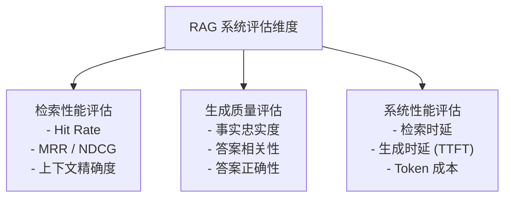
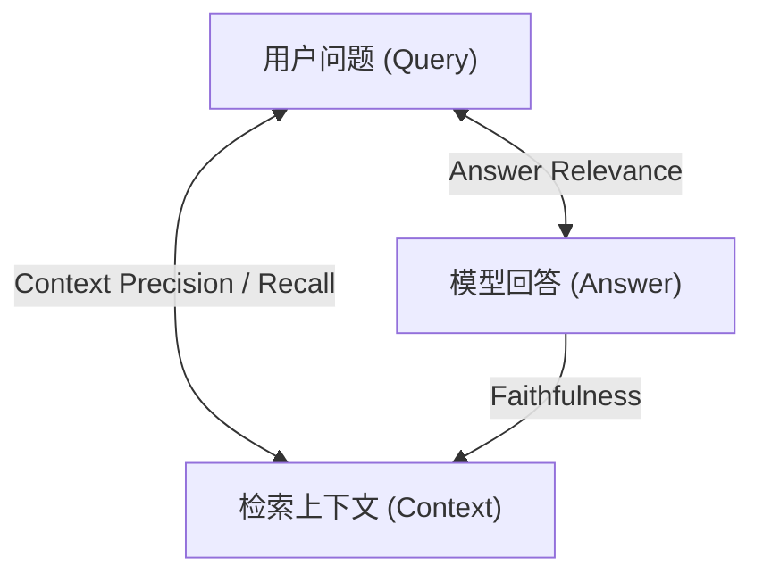
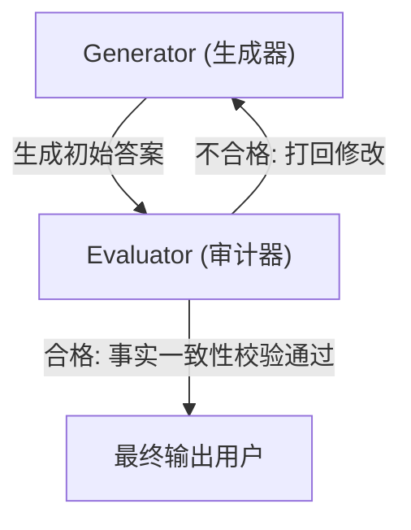

# RAG 评估与幻觉控制知识手册

本手册专注阐述 RAG（检索增强生成）系统开发中最难攻克的两大关卡：**评估体系的建立**与**幻觉（生成错误事实）的控制**。涵盖了 RAG 三元组理论、主流评估框架的工作原理、黄金测试集合成方法以及在线/离线全链路幻觉拦截方案。

---

## 📋 目录
- [一、 RAG 三元组与评估体系 (Q1-Q4)](#一-rag-三元组与评估体系-q1-q4)
- [二、 幻觉产生的根源与检索层治理 (Q5-Q6)](#二-幻觉产生的根源与检索层治理-q5-q6)
- [三、 生成层防幻觉与引用溯源设计 (Q7-Q8)](#三-生成层防幻觉与引用溯源设计-q7-q8)
- [四、 智能反思纠正与安全兜底拒绝 (Q9-Q10)](#四-智能反思纠正与安全兜底拒绝-q9-q10)

---

## 一、 RAG 三元组与评估体系 (Q1-Q4)

### Q1: 评估一个 RAG 系统，应该从哪些维度和指标切入？

工业界评估 RAG 系统，需要采取**多维度、多阶段分层评估**的思路，不能仅看最终回答的通顺度。



1. **检索阶段评估（Retrieval Stage）**：
   - 关注“查得全不全、准不准”。
   - **代表指标**：Hit Rate (命中率 - Top-K 中是否存在正确文档)、MRR (平均倒数排名 - 正确文档排在第几名)、NDCG (归一化折损累减增益 - 衡量整体排名的科学性)。
2. **生成阶段评估（Generation Stage）**：
   - 关注“回答是否编造、是否答非所问”。
   - **代表指标**：语义相似度、事实忠实度（Faithfulness）、答案相关性（Answer Relevance）。
3. **端到端与系统级评估（System-level）**：
   - **代表指标**：吞吐量（Throughput）、首字输出延迟（TTFT）、单次检索回答的 API Token 消耗。

---

### Q2: 什么是 RAG 评估的三元组（RAG Triad）？请详细解释 Faithfulness、Answer Relevance 和 Context Precision/Recall。

**RAG 三元组（RAG Triad）**是由 TruLens 团队提出的，对 RAG 检索-生成闭环进行事实和语义逻辑约束的经典评估模型。它解耦了 RAG 的中间环节，避免了传统端到端评估由于信息混杂导致的打分失灵。



#### 1. Faithfulness (忠实度 / 无幻觉度)
- **评估对象**：Answer (A) vs Context (C)
- **定义**：衡量生成的回答是否**完全基于**检索出来的上下文。回答中表述的所有事实，必须在上下文中找到直接的文本证据。
- **目标**：杜绝 LLM 凭借自身权重参数进行编造（即控制幻觉）。

#### 2. Answer Relevance (答案相关性)
- **评估对象**：Answer (A) vs Query (Q)
- **定义**：衡量生成的回答是否直接针对用户的提问进行解答，是否存在跑题、啰嗦或答非所问。
- **目标**：确保回答切题，提升用户交互体验。

#### 3. Context Precision (上下文精确度)
- **评估对象**：Context (C) vs Query (Q)
- **定义**：衡量检索到的 Chunks 中，真正包含答案所需核心事实的片段，是否被高优先级排在了检索列表的头部。
- **目标**：评估检索和重排的准确度，减少大模型阅读冗余噪声的概率。

#### 4. Context Recall (上下文召回率)
- **评估对象**：Context (C) vs Ground Truth (标准答案)
- **定义**：衡量检索到的内容是否完整涵盖了解答该问题所需的全部知识要点。通常需要与黄金标准答案（Ground Truth）进行比对。

---

### Q3: 如何自动化构建用于 RAG 评估的“黄金测试集（Golden Dataset）”？

在真实工程中，完全依赖人工编写数百个“问题-上下文-标准答案”三元组用于测试是极度低效的。目前主流的实践是采用 **LLM 辅助合成法**：

1. **高信息量文档采样**：从文档库中随机抽样一定比例的高质量 Chunk 作为生成种子。
2. **多模态意图拟真生成**：
   使用强模型（如 GPT-4）阅读这些 Chunk，执行特定指令生成问答对：
   - *指令 A (事实型问题)*：“请根据这段文本，生成一个用户可能提问的事实性问题，并给出标准答案。”
   - *指令 B (多跳推理型问题)*：“请结合这段代码及其依赖说明，生成一个需要推理两步才能回答的复杂问题。”
   - *指令 C (否定/无答案型问题)*：“请参考该文本，设计一个看似相关但实际上在此文本中找不到答案的迷惑性问题。”
3. **质量过滤与去噪**：
   - 过滤掉问题与答案长度过短、语义重复度过高的项。
   - 使用规则匹配，确保生成的问答不含有“如上文所述”等暴露 Prompt 拼接痕迹的词汇。
4. **人工校准（Human-in-the-loop）**：由研发或业务专家对合成的问答对进行小样本随机抽样评审（如抽取 10%），剔除语病或逻辑不合规的数据，最终留存 150 - 300 条极具代表性的数据作为回归测试集。

---

### Q4: 介绍主流的 RAG 评估框架（如 Ragas、TruLens、G-Eval）及其底层评估原理（LLM-as-a-Judge）。

#### 1. 底层评估原理：LLM-as-a-Judge (大模型作为裁判)
因为传统的字符串匹配指标（BLEU, ROUGE）无法判断复杂的语义对齐与事实忠实度。现代框架大多使用功能最强大的大语言模型（如 GPT-4）担任裁判。通过精心设计的 Chain-of-Thought（思维链）Prompt，引导裁判模型执行拆解打分。
- **以 Ragas 评估 Faithfulness 为例**：
  1. **Claim Extraction**：裁判 LLM 首先将 RAG 系统生成的 Answer 拆分为数个独立的单句事实描述（Claims）。
  2. **Verdict Verification**：裁判 LLM 逐一比对这些 Claims，判断其能否从检索到的 Context 中推导出来，输出 `Yes` 或 `No`。
  3. **Score Calculation**：$\text{Score} = \frac{\text{输出 Yes 的 Claims 数量}}{\text{Claims 总数量}}$。

#### 2. 主流框架对比

| 框架名称 | 核心优势 | 适用场景 |
| :--- | :--- | :--- |
| **Ragas** | 开源纯 Python 开发；指标非常贴合 RAG 三元组模型；支持自动化批量回归测试。对于离线指标监控非常方便。 | 开发期检索分片策略调优、CI/CD 自动化流水线集成。 |
| **TruLens** | 提供精美的 Web Dashboard；支持实时的“反馈回路模型（Feedback Loops）”；对 LangChain、LlamaIndex 原生集成度极高。 | 生产环境下的检索回答实时质量监控与大屏展示。 |
| **G-Eval** | 具有极强的通用泛化性；允许用户使用自然语言自定义打分细则（评分红线），由 LLM 自动演绎执行。 | 垂直领域、高度定制化业务场景下的主观生成质量评估。 |

---

## 二、 幻觉产生的根源与检索层治理 (Q5-Q6)

### Q5: RAG 系统中产生“幻觉”的主要原因有哪些（检索端 vs. 生成端）？

RAG 系统的幻觉不仅来自于大模型本身，很多时候是由检索管道的设计缺陷导致的：

#### 1. 检索端原因 (检索质量差)
- **召回缺失（Recall Failure）**：知识库中根本不存在该信息，或者检索器由于词汇鸿沟没能找出相关的文档，导致 LLM 被迫在“无事实依据”的情况下开始脑补。
- **噪声泛滥（Low Precision）**：召回了太多不相干甚至相互矛盾的文档片段，导致核心证据被噪声淹没，LLM 注意力被分散。
- **切片截断（Semantic Fragmentation）**：Chunking 策略过粗暴，将关键的前提条件（如“在测试环境下才可以执行...”）切断在另一个未召回的 chunk 里，导致 LLM 得出具有误导性的结论。

#### 2. 生成端原因 (生成约束失效)
- **预训练先验记忆冲突**：LLM 固执地相信自己预训练时学到的陈旧知识，从而忽略或强行修改了上下文里提供的正确事实。
- **指令遵循度不足**：当 Prompt 约束力度不够时，LLM 倾向于扮演“什么都知道”的角色，在资料不足时依然强行回答，编造事实。
- **采样随机性失控**：系统设置的 Temperature 过高，使得生成路径带有过强的不确定性。

---

### Q6: 如何从检索层源头减少幻觉的发生？

1. **混合检索与重排序（BM25 + Dense + Rerank）**：
   - 向量检索保证捕获语义，BM25 保证精确匹配，双路召回大幅提高召回率。
   - 使用 Reranker 过滤相似度分数过低的 chunk，剔除噪音，只给 LLM 递送高可信度核心背景。
2. **Small-to-Large (父子分块召回)**：
   - 检索时通过 100-200 Token 的子分块保障语义的精准定位。
   - 匹配成功后，自动向上拉取包含其前后的 800 Token 的父块（或者完整的代码函数结构），确保逻辑关系连贯，防止断章取义。
3. **时效与元数据硬过滤（Pre-filtering）**：
   - 在元数据中记录更新时间，检索时优先过滤掉废弃或过期的旧文档，防止大模型采信历史冗余信息。

---

## 三、 生成层防幻觉与引用溯源设计 (Q7-Q8)

### Q7: 如何在生成层（Prompt 约束、采样参数如 Temperature）进行防幻觉设计？

1. **严格的围栏 Prompt (System Prompt Guardrails)**：
   在系统提示词中给予强约束，明确设定惩罚和拒绝规则。例如：
   > **【防幻觉 Prompt 范式】**
   > “你是一名严谨的知识库助手。请**仅仅且完全**基于给定的【上下文】回答用户提问。
   > **规则红线**：
   > 1. 如果问题在【上下文】中没有提及，或者信息不足以支撑回答，你必须直接、诚实地回答‘抱歉，根据已知文档我无法确认该问题的答案。’，绝对禁止编造任何事实或凭经验进行猜测。
   > 2. 你的回答中不能包含任何【上下文】中没有出现的实体、专有名词或参数。”
2. **限制采样自由度 (Sampling Control)**：
   - 将 `temperature` 设为 `0` 或接近 `0`（如 `0.1`），使大模型每次都倾向于选择概率最高的词，保持输出的确定性。
   - 将 `top_p` 设为 `0.9` 左右，限制发散。
3. **Few-Shot 负面拒绝示例**：
   在 Prompt 中提供 2-3 个“上下文不足时主动说不知道”的微型对话范例（Few-shot），显著提升模型的指令依从性。

---

### Q8: 什么是引用溯源（Attribution / Citation）？如何在工程上强制模型实现精确的证据引用？

**引用溯源**是指在 LLM 生成的每一句关键结论后面，标注出该结论来自于哪一个文档切片（如 `[1]`, `[file_a.md: L23]`），使用户可以通过高亮点击直接查看原始出处，从而建立极高的工程信任度。

```
大模型回答：
MySQL 出现 CPU 暴满，通常是由于执行了全表扫描操作且缺少适当的索引 [1]。
建议通过 EXPLAIN 命令检查 SQL 执行计划 [2]。

【数据源引用对照】
[1] f:/problems/mysql.md (行号: 15-20)
[2] f:/problems/explain.md (行号: 44-50)
```

#### 工程实现步骤：

1. **上下文格式化标记**：
   在向 Prompt 拼接检索到的 Chunks 时，为每个 Chunk 包装上带有唯一编号的元数据信封。
   ```text
   【文档 [1] - 来源: src/database.py - 行号: 12-25】
   ...代码/文本内容...

   【文档 [2] - 来源: docs/setup.md - 行号: 102-110】
   ...说明内容...
   ```
2. **强制引用指令**：
   在 Prompt 中要求 LLM 必须使用 Markdown 的脚注或特定格式（如 `[N]`）标记其事实来源。
3. **输出解析与后处理校验（Attribution Checker）**：
   后端在拿到模型返回的答案时，进行正则扫描匹配（如检测出 `\[(\d+)\]`），核实大模型使用的编号是否在本次检索分配的有效编号集合内。若发现模型无中生有使用了 `[9]` 这样的越界编号，则拦截此答案，触发降级回复或重试。

---

## 四、 智能反思纠正与安全兜底拒绝 (Q9-Q10)

### Q9: 什么是 Self-RAG 和 Self-Correction（自纠正机制）？如何在生成过程中引入反思和校验逻辑？

#### 1. Self-RAG (自我检索增强生成)
- **机制**：引入特定的**反思标记（Reflection Tokens）**。LLM 经过训练后，可以主动判断自己是否需要调用外部工具进行检索（输出 `[Retrieve]` 标记），并对生成的段落进行三个维度的自我打分：
  - `Is-Rel`：生成的内容是否与 Query 相关。
  - `Is-Sup`：生成的句子是否得到了检索文本的支持（忠实度）。
  - `Is-Use`：生成的句子是否对解答问题有用。
- 整个系统根据这些打分指标，自适应地筛选最佳的生成流。

#### 2. Self-Correction (自纠正 / 事实一致性审查)
在 Agent 工作流中，将生成和审计解耦为两个步骤（可使用 LangGraph 等多智能体工作流实现）：



- **实现**：
  1. **步骤一**：生成器模型结合上下文输出初稿。
  2. **步骤二**：审计器模型（可选用成本较低的模型或强规则）读取（Query + 上下文 + 初稿），回答布尔问题：“初稿中的第X句话在上下文里有支撑吗？如果是或否，请给出理由”。
  3. **步骤三**：如果发现不一致，自动将审计意见拼回 Prompt，让生成器进行第二轮修正。

---

### Q10: 如何实现检索质量评估与兜底拒绝机制，避免模型强行回答未知问题？

为保证企业级 RAG 系统的安全性，必须建立多重安全阀门，在模型“张嘴胡说”前予以拦截。

1. **Rerank 分数硬门槛（Confidence Gate）**：
   - 检索并重排后，系统检查 Top-1 候选 Chunk 的重排相关性分数。
   - 如果最高分都低于设定阀值（例如 BGE-Reranker 分数低于 `0.35`），说明知识库中极大概率没有相关信息。
   - **直接拦截**：系统直接拒绝调用大模型，立刻返回友好兜底文案（如：“对不起，目前系统内部知识库中未检索到与您提问相关的标准说明。”），从源头上规避大模型因为空上下文引起的胡言乱语。
2. **意图路由（Intent Router）**：
   - 检索发生前，引入分类器（如小模型或关键词槽匹配），将用户的问题路由到不同分支。如果问题属于涉密敏感词、违法言论或完全无关的日常闲聊，直接路由到快速拒答器。
3. **输出拦截器（Output Guardrails / Regex Checker）**：
   - 要求大模型在没有信息时，必须输出一个固定且不重复的标识符，如 `[SORRY_NO_INFO]`。
   - 后端一旦检测到输出中包含此标识符，直接将其转换成统一格式的精美系统拒答界面。
