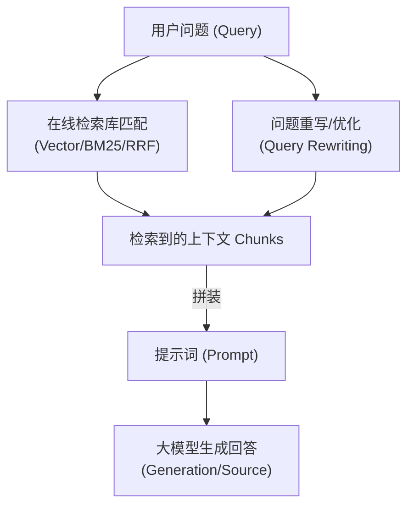
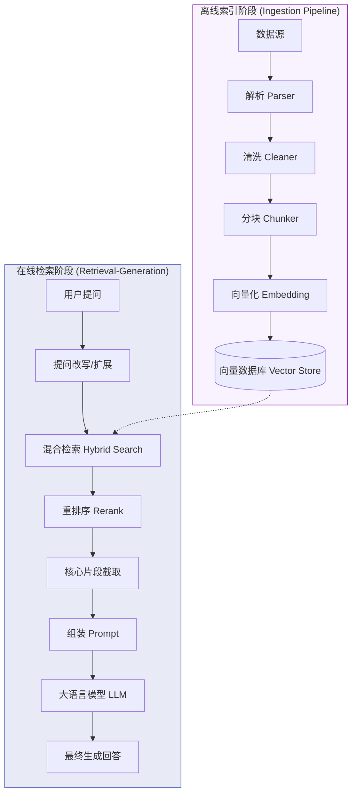
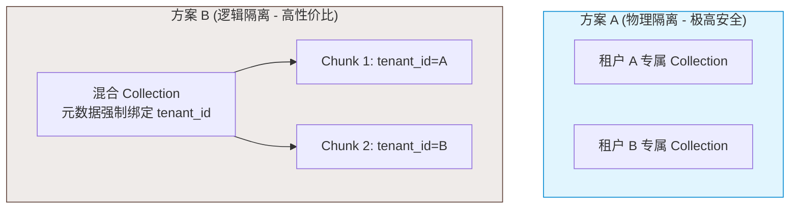

# RAG 高频基础知识手册

本手册汇集了检索增强生成（Retrieval-Augmented Generation, RAG）在面试与工程实践中最频繁遇到的 30 个核心基础问题。旨在帮助开发者深入掌握数据解析、清洗、切分（Chunking）以及索引安全维护的全链路细节。

---

## 📋 目录
- [一、 RAG 核心概念与优势对比 (Q1-Q7)](#一-rag-核心概念与优势对比-q1-q7)
- [二、 文档解析、清洗与分块策略 (Q8-Q17)](#二-文档解析清洗与分块策略-q8-q17)
- [三、 特殊文档与代码仓库切分实践 (Q18-Q25)](#三-特殊文档与代码仓库切分实践-q18-q25)
- [四、 索引动态维护与安全权限 (Q26-Q30)](#四-索引动态维护与安全权限-q26-q30)

---

## 一、 RAG 核心概念与优势对比 (Q1-Q7)

### Q1: RAG 是什么？
**RAG (Retrieval-Augmented Generation，检索增强生成)** 是一种将**外部知识检索**与**大语言模型生成能力**相结合的技术。
在模型接收到用户提问（Query）时，RAG 的标准运作流程如下：
1. **检索（Retrieve）**：通过语义向量或关键词匹配，从外部知识库（文档、数据库等）中检索出与提问高度相关的文档片段（Chunks）。
2. **增强（Augment）**：将检索到的上下文片段与用户的原始提问共同编排进 Prompt 中。
3. **生成（Generate）**：将组装好的 Prompt 发送给大语言模型（LLM），由 LLM 基于所提供的“证据”生成最终回答。



---

### Q2: RAG 解决了什么问题？
1. **知识时效性限制 (Knowledge Cutoff)**：LLM 预训练知识仅停留在其训练截止时间。RAG 允许接入实时数据，无需重新训练模型。
2. **减少事实性幻觉 (Hallucination)**：LLM 常常“一本正经地胡说八道”。通过将外部客观证据注入上下文，可强力约束 LLM 只基于给定事实回答，显著降低幻觉。
3. **私有/专属领域知识空白**：企业内部机密文档、特定项目源码等不公开的数据，LLM 预训练无法获取。RAG 可安全、即时地为 LLM 接入这些知识。
4. **高昂的微调成本**：相比频繁地重新训练、微调（Fine-tuning）大模型，更新外部知识库（增删改文档）仅需毫秒级，成本极低。
5. **回答无法追溯 (Lack of Attribution)**：RAG 可以在生成的回答中精准附带数据来源（如引用文件名、行号、网页链接等），使得输出结果可被核实与审计。

---

### Q3: RAG 不能解决什么问题？
1. **基座模型的基本推理能力**：RAG 只能提供信息，如果问题需要极其复杂的逻辑演绎、多步数学计算、或者深度的跨领域推理，基座模型推理能力弱依然会回答错误。
2. **大模型的指令遵循能力**：如果 LLM 的对齐（Alignment）较差，即使检索到了完美相关的上下文，它可能仍然忽略 Prompt 里的约束规则，编造事实或输出格式错误。
3. **检索端的质量上限（Garbage in, Garbage out）**：如果数据准备差、检索算法低效，导致召回的全部是噪声或无关段落，LLM 巧妇难为无米之炊，依旧会得出错误答案。
4. **隐性风格与交互规范**：RAG 无法训练 LLM 改变人设风格或学会特定的交互动作。

---

### Q4: 为什么不用微调而用 RAG？
RAG 与微调（Fine-tuning）代表了让 LLM 学习新知识的两种完全不同的路线，两者的核心对比如下：

| 对比维度 | RAG (检索增强生成) | Fine-tuning (微调) |
| :--- | :--- | :--- |
| **知识更新时效** | 实时（毫秒级，仅需更新向量库或倒排索引） | 慢（需要收集数据、训练、评估并重新部署模型） |
| **工程与算力成本** | 低（主要是数据预处理和向量存储，几乎无 GPU 训练开销） | 高（需要大量 GPU 算力及专业的数据标注工程） |
| **事实准确性(防幻觉)**| 极高（可以强制模型“只按给定文献回答，否则回答不知道”）| 中低（通过权重记忆，依然有很高的事实混淆与幻觉风险） |
| **来源可追溯性** | 极强（支持高亮引用、精准指明文档出处与行号） | 无法追溯（知识已被融合进百亿级别的模型参数中） |
| **适用场景** | 事实查询、企业知识库、时效性强的数据检索 | 人设包装、特定语言风格、特殊任务格式输出（如SQL生成） |

> [!TIP]
> **面试黄金回答**：
> “在实际工程中，RAG 和微调并不是非此即彼的。一般先用 **RAG** 解决知识的时效性、私有数据召回与引用溯源问题；当需要统一输出格式、学习特定领域术语的表达风格、或在无网环境下运行时，再结合**微调**对模型进行调优。”

---

### Q5: 为什么不用长上下文而用 RAG？
虽然当前大模型（如 Gemini 1.5, GPT-4o）宣称拥有数十万到上百万 Token 的超长上下文窗口，但 RAG 依然是不可替代的核心架构，原因在于：
1. **推理延迟与算力成本（Latency & Cost）**：大模型的首字延迟（TTFT）与 Token 开销随着上下文长度增加呈急剧上升趋势。若每次简单查询都强行拼入整个项目代码或几十万字的产品手册，其运行成本与响应速度在商业落地上完全不可接受。
2. **Lost in the Middle 现象**：研究表明，当上下文极长时，LLM 容易忽略位于中间部分的上下文，注意力主要集中在 prompt 的头部和尾部。直接灌入过多无关信息会导致关键事实被淹没。
3. **高并发下的硬件极限**：高并发场景下，海量长上下文请求会瞬间塞满 GPU 的 Key-Value Cache（KV 缓存），导致系统吞吐量雪崩。
4. **知识库规模超出极限**：当企业级知识库达到 GB 甚至 TB 级别时，任何模型的上下文窗口都无法放得下，必须依靠检索粗筛。

---

### Q6: 长上下文模型出现后，RAG 还有必要吗？
**非常有必要。长上下文模型与 RAG 是“强强联手”的互补关系。**
1. **从“RAG vs 长上下文”转向“RAG + 长上下文”**：在海量知识库中，RAG 扮演**粗筛定位器**，将几十万份文档过滤至几十份最相关的片段（比如 50K Token 的高度相关资料）；长上下文模型扮演**深度推理器**，在召回的几十份文档中进行多点对比、事实总结与深度逻辑合成。
2. **极限降本**：通过 RAG 精准剪枝掉 95% 以上的无用背景文本，将大幅降低单次大模型调用的 API 费用。

---

### Q7: 一个完整 RAG 系统有哪些阶段？
一个完整的工业级 RAG 系统分为**离线索引阶段**与**在线检索回答阶段**：



---

## 二、 文档解析、清洗与分块策略 (Q8-Q17)

### Q8: 文档解析阶段会遇到什么问题？
1. **排版与双栏布局错乱**：解析双栏排版的 PDF 时，简单解析器会横向读取，将左栏和右栏内容拼在一行，破坏句子的连贯性与语义。
2. **多模态元素（表格、图表、公式）丢失**：文档内的嵌入表格、流程图、复杂的数学公式（如 LaTeX 符号）容易被解析为乱码或直接丢失。
3. **扫描件与 OCR 误差**：很多企业文档是扫描版 PDF 或图片，OCR（光学字符识别）会产生错别字、漏字、排版位移等问题。
4. **元数据丢失**：解析器如果只提取出纯文本，会丢失原本非常重要的标题结构（H1, H2）、页码、作者等关键定位信息。

---

### Q9: 文档清洗阶段要清洗什么？
1. **格式与标签噪声**：去除 HTML 标签、XML 实体、乱码的控制字符、无意义的重复换行（如连续的 `\n\n\n\n`）与多余空格。
2. **文档元噪声**：过滤统一的页眉、页脚、免责声明、版权宣告、页码等，防范它们成为干扰语义检索的系统性噪音。
3. **数据敏感脱敏**：清洗或隐藏身份证号、手机号、企业内部密钥、测试密码等敏感信息（PII）。
4. **文本标准化**：统一全角半角标点符号，处理繁简转换以及错位换行符补全。

---

### Q10: chunk 切分有哪些策略？
1. **固定长度切分 (Fixed-size Chunking)**：设定固定 Token/字符数（如 512），并设置固定重叠长度进行机械切分。
2. **基于天然结构切分 (Structural Chunking)**：利用 Markdown 的标题层级、代码的函数/类定义、HTML 的段落标签进行结构化切分。
3. **语义切分 (Semantic Chunking)**：利用 Embedding 模型计算相邻句子的相似度，当相似度低于设定阈值时切分，确保每个 chunk 在语义上是自连贯的。
4. **父子块切分 (Parent-Child / Small-to-Large)**：切分为小的子块（如 100 Token，便于语义搜索精准匹配）和大的父块（如 800 Token，保留完整上下文）。检索时匹配到子块，但塞给大模型的是大父块。

---

### Q11: chunk size 怎么选？
通常，没有万能的 chunk size，需要根据业务场景和模型特性来平衡：
- **学术论文/法律条文**：需要较强的上下文论证，建议选**较大**的 chunk（如 500 - 1000 Tokens）。
- **常见问题解答（FAQ）/客服库**：问答本身很短，建议选**较小**的 chunk（如 100 - 300 Tokens）。
- **Embedding 模型限制**：若 Embedding 模型最大支持 512 Token，chunk size 应控制在 400 左右，预留余量，防止被强制截断。
- **推荐经验**：从 **300 - 500 字符（约 150-250 Tokens）** 起步，并设定 **10% - 20% 的 overlap** 是一个优秀的通用初始配置。

---

### Q12: chunk overlap 有什么作用？
- **保护语义完整性**：防止一个核心观点或关键实体恰好落在切片边界上而被切断（如“前50字在Chunk A，后50字在Chunk B”）。
- **提供上下文平滑**：使相邻的 chunk 之间有信息过渡，保证 Embedding 在向量空间中的计算精度，避免检索边界处的语义割裂。

---

### Q13: overlap 过大会有什么问题？
1. **冗余数据挤占窗口**：大模型接收到的 Top-K 上下文里充满了大面积重复的内容，白白浪费了大模型的 Context 长度与 Token 费用。
2. **检索多样性下降**：如果召回的 Top-3 文档由于 overlap 过大而高度雷同，可能会挤掉原本相关但排在稍后位置的其他视角的关键文档。
3. **干扰重排分值**：高重复性的段落可能让 Reranker 重排序打分失衡，甚至引起模型生成重复啰嗦的回答。

---

### Q14: 按固定 token 切分有什么缺点？
- **语义灾难性割裂**：它不考虑标点符号、句子或句义的结束，硬生生地截断文本。可能会把一个单词一分为二，或者将否定词（如“不”、“严禁”）从前句切到下个 chunk，从而产生严重的**幻觉与事实扭曲**。

---

### Q15: 按标题切分有什么缺点？
- **重度依赖文档质量**：如果文档结构不规范、标题层级缺失（例如整篇文档没有 `#` 号，或者通篇都是加粗字体而非标准 Markdown 标题），切片器会彻底失效，导致产生超长或极其碎小的 chunk。

---

### Q16: 按语义切分有什么缺点？
- **算力与时间开销极大**：对长文档而言，必须计算每两个相邻句子之间的 Embedding，如果文档非常庞大，这需要消耗极大的计算算力与 API 成本，系统吞吐量极低。
- **阈值难以泛化**：难以设定一个完美的相似度阈值让所有类型的文档都切分得恰到好处。

---

### Q17: 代码场景为什么不能简单按段落切分？
1. **控制流逻辑断裂**：代码的核心语义单位是函数或类。简单段落切分会将同一个函数的参数声明、局部变量定义、以及底部的 `return` 语句分割在不同的 chunk 中，导致大模型无法理解代码的完整运作逻辑。
2. **基础依赖（Imports）丢失**：被切出的代码段失去了文件头部的 `import`、`namespace` 声明，LLM 将无法获知这些符号是从哪里引入的。

---

## 三、 特殊文档与代码仓库切分实践 (Q18-Q25)

### Q18: Markdown 文档怎么切？
1. **利用语法解析器（如 `MarkdownHeaderTextSplitter`）**：
   - 提取 Markdown 的各级标题（`#`, `##`, `###`）。
   - 将内容切分为以标题为单位的块，并将标题层级路径（例如 `{"H1": "安装指南", "H2": "Linux配置"}`）写入 chunk 的元数据（Metadata）中。
2. **长度约束机制**：如果在某一标题下的内容仍然超过 chunk size 上限，则在此层级下调用基于段落/句子的递归字符切片器进行二次微切。

---

### Q19: PDF 文档怎么切？
1. **双栏/版面还原**：利用具有版面分析能力（Layout Analysis）的解析器（如 `MinerU`, `LayoutLM`）将多栏、单栏、页眉页脚进行物理定位，保证阅读流是正确的单向流。
2. **逻辑分块**：提取页码、大纲结构，将每个大纲章节作为逻辑大块。
3. **元数据溯源**：在每一个 chunk 写入 `page_number`（页码）、`file_path` 等信息，确保大模型回答时能够精准指明“在PDF第 X 页提到...”。

---

### Q20: 表格文档怎么切？
表格如果按行直接切分，会丢失列头（Header）的约束关系，大模型拿到数据后根本无法对齐。
- **方案 A：结构格式化**：将表格统一转换为 Markdown 表格格式（保留 `|` 符号）或 HTML `<table>` 格式存储。
- **方案 B：行头键值化（Row-wise with Headers）**：将表格的表头与对应行的值结合。例如把表格的某行转化为：`“指标: 营业额; 年份: 2025; 数据: 5000万”`。
- **方案 C：大模型摘要关联（Summarization Index）**：用 LLM 对表格生成一段自然语言摘要（如“该表格展示了公司2025年各季度的营业额变化...”），将摘要存入向量库。检索匹配到摘要向量后，把完整的 Markdown 表格塞给 LLM 作为上下文。

---

### Q21: API 文档怎么切？
- **按 Endpoint 独立切分**：将每个 API 接口（如一个完整的 `POST /v1/chat`）定义、请求体 JSON、响应体 JSON 示例以及参数解释划分为一个不可分割的完整 Chunk。
- **元数据强化**：记录 API 分类、Base URL、认证方式，利于大模型在做 Tool Calling 或编写代码调用时获取完整信息。

---

### Q22: 代码仓库怎么切？
代码切分必须采用 **AST（抽象语法树）分块法**：
1. **语法解析**：使用 `tree-sitter` 或 Python 的 `ast` 库解析代码文件。
2. **语法树切分**：识别所有的类定义（Class）、函数定义（Function），将它们单独抽离成 chunk。
3. **依赖继承补充**：在每个方法的 chunk 头添加类的声明或当前文件头部的 `import` 语句。
4. **元数据绑定**：在元数据中详细记录 `file_path`、`start_line`、`end_line` 以及函数签名（如 `def query_database(...)`），为代码的可验证性和溯源提供物理依据。

---

### Q23: 一个函数太长怎么办？
1. **AST 逻辑块再细分**：分析函数内部的逻辑分支，将长循环（`for`/`while`）、庞大的匹配控制流（`switch`/`case`）拆分为独立子块。
2. **父子块索引模式 (Small-to-Large)**：将长函数切成小段向量匹配，一旦匹配中，自动回溯获取其所属的整个函数的代码块（Parent Chunk）输入给 LLM。
3. **Agent 动态工具协同**：如果函数长度逼近限制，RAG 仅返回函数头及大纲，LLM 可以通过调用 `read_file` 工具，按需动态拉取这个超长函数的特定行。

---

### Q24: 一个类太长怎么办？
- **基础定义与方法剥离**：将类的基本声明（如类名、构造函数 `__init__`、属性成员变量等）切成“基块（Base Chunk）”，将每个类方法（Method）切成独立的“子块”。
- **语义链接**：子块的元数据指向基块，检索到某个方法子块时，自动将“基块”拼接在它的头部，保证 LLM 能看懂此方法属于哪个类、有哪些类属性。

---

### Q25: 一个文件里多个功能混在一起怎么办？
- **完全拆解实体**：禁止简单按物理文件分块。必须用 AST 解析，按不同的类、独立的辅助函数将其物理切开，形成不相干的独立向量块。
- **构建 Outline 导航块**：为该文件单独生成一个 Outline 块（如：“该文件包含 A、B、C 三个核心函数，分别负责...”），用户搜索宽泛词时先命中 Outline，再通过 Agent 查找具体的内部函数。

---

## 四、 索引动态维护与安全权限 (Q26-Q30)

### Q26: 文档更新后如何增量索引？
1. **指纹校验机制 (MD5/SHA256)**：在数据库中记录每个源文件切分前的哈希指纹。更新时对比哈希，如果一致则跳过解析。
2. **先删后插（Delete-then-Insert）**：如果哈希指纹改变，说明文件有改动。利用元数据中的 `document_id` 过滤，物理删除该文档在向量库里的所有旧 chunks，随后对新内容重新切分并计算向量写入数据库。
3. **持久化同步管理器**：引入如 LangChain 的 `SQLRecordManager` 或 LlamaIndex 的 `IngestionPipeline`，对数据清洗、转化、向量化建立端到端的事务性状态记录，实现精准的差量同步。

---

### Q27: 删除文档后如何清理索引？
1. **文档 ID 联动（Cascading Delete）**：所有分块写入向量数据库时，元数据（Metadata）中必须强制记录源文档的 `document_id`。
2. **条件删除**：当源文档被物理删除时，触发同步脚本，向向量库发送批量条件删除指令，如：
   `db.delete(where={"document_id": target_doc_id})`
3. **定期双向对齐校验（Garbage Collection）**：在系统闲时运行对齐任务，检查向量数据库中所有的 `document_id` 在物理存储介质中是否真实存在，对残留的孤立向量进行强制清理。

---

### Q28: 文档权限变化后如何更新索引？
- **元数据动态刷新**：不要将权限信息与内容混合进行 Embedding 编码（因为权限改变不需要重新计算语义向量）。应在向量数据库的 `metadata` 中维护一个权限控制列表（ACL），例如 `metadata.allowed_roles = ["Admin", "HR"]`。
- **低延迟刷新**：当权限系统发生变更，运行一个脚本，直接更新对应 Chunk 的 `metadata` 字段，该操作在绝大多数主流向量数据库中为原地的元数据写入，无需重算向量，非常轻量。

---

### Q29: 如何避免检索到用户无权限的内容？
在向向量数据库发起相似度检索时，**强制使用 Pre-filtering（前置元数据过滤）**：
1. **身份获取**：从系统 Session 或 Token 中解析当前用户的 User ID、所属群组（Groups）与安全等级（Roles）。
2. **前置过滤检索**：在调用相似度搜索时，同时传入过滤条件。例如：
   ```python
   # 使用 Chroma/Milvus 等库的前置过滤 API
   results = vector_store.similarity_search(
       query="2025年财报数据",
       k=5,
       filter={
           "allowed_groups": {"$in": user.groups}
       }
   )
   ```
3. **安全性保障**：前置过滤会先剔除无权文档，再在此基础上计算相似度向量，从物理上隔绝越权数据召回的可能性。

---

### Q30: 如何处理多租户知识库？
处理多租户（Multi-tenant）主要有以下两种工程隔离级别，根据安全等级和资源成本灵活选择：



1. **物理隔离（Physical Isolation）**：
   - **实现**：为每一个租户在向量库中创建独立的 Namespace（命名空间）或者不同的 Collection/Table。
   - **优点**：数据完全物理隔离，安全性最高，绝无越权可能，支持针对单个租户做备份与销户清理。
   - **缺点**：如果租户数量极其庞大，会导致向量数据库实例和连接数暴增，资源开销大。
2. **逻辑隔离（Logical Isolation）**：
   - **实现**：所有租户的数据混合存放在同一个 Collection 中，但每个 chunk 被强制打上元数据 `tenant_id`。
   - **安全红线**：每次检索时，后端代码**必须硬编码**加上过滤条件 `filter={"tenant_id": current_tenant.id}`。此方案代码审计需要极其严格，防止由于 Bug 导致的多租户越权灾难。