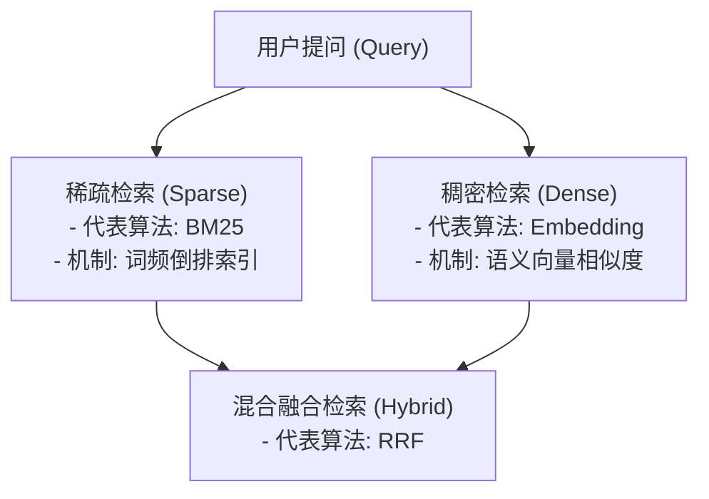
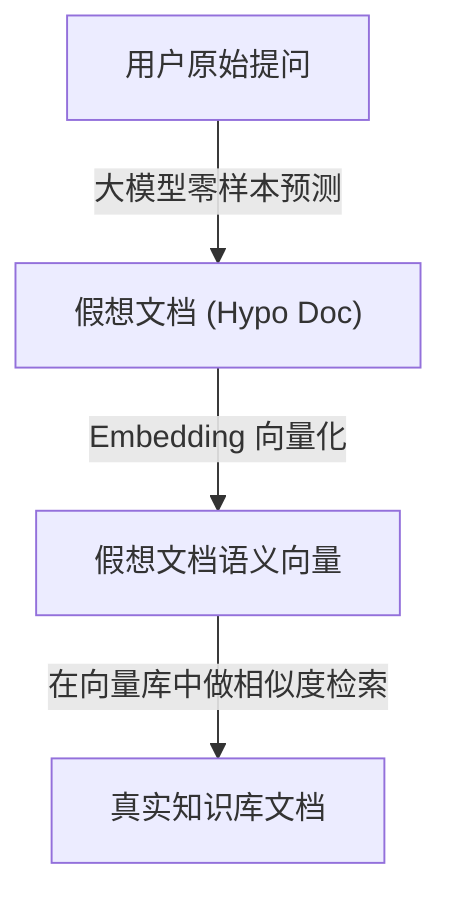

# RAG 检索、召回与排序知识手册

本手册专门探讨 RAG（检索增强生成）系统在线检索阶段的核心技术架构。涵盖了稠密与稀疏检索原理、混合检索的数学融合方法（RRF）、向量索引设计、Query 侧优化（改写与 HyDE）以及精排（Re-ranking）的最佳工程实践。

---

## 📋 目录
- [一、 双通道检索与融合 (Q1-Q2)](#一-双通道检索与融合-q1-q2)
- [二、 向量相似度与高效索引 (Q3-Q4)](#二-向量相似度与高效索引-q3-q4)
- [三、 检索前置过滤与 Query 优化 (Q5-Q7)](#三-检索前置过滤与-query-优化-q5-q7)
- [四、 重排序与上下文压缩 (Q8-Q10)](#四-重排序与上下文压缩-q8-q10)

---

## 一、 双通道检索与融合 (Q1-Q2)

### Q1: 向量检索（Dense）与关键词检索（Sparse，如 BM25）的核心原理、优势及局限性是什么？

在大规模 RAG 工程实践中，通常使用两种不同机制的检索通道：



#### 1. 稀疏检索（Sparse Retrieval，以 BM25 为代表）
- **核心原理**：基于词频（TF）、逆文档频率（IDF）以及文档长度惩罚来计算文本相似度。它将文本表征为与词表同等维度的极高维、极稀疏向量，仅在词表中存在的单词对应维度上有非零权重。
- **优势**：
  1. **精确硬匹配**：能百分百精准定位代码符号（如 `get_user_by_id`）、产品型号（如 `A100`）、专有名词和序列号。
  2. **无需算力开销**：构建倒排索引和检索仅需 CPU，内存开销极小，速度极快。
  3. **可解释性**：基于数学统计打分，每个词的贡献清晰可查。
- **局限性**：
  1. **词汇鸿沟（Vocabulary Mismatch）**：若用户提问与文档表述使用了不同的近义词（如“电脑”与“计算机”），则无法召回。
  2. **缺乏语义关联**：无法捕捉隐式逻辑和长句语义。

#### 2. 稠密检索（Dense Retrieval，以语义向量 Embedding 为代表）
- **核心原理**：利用预训练的双塔深度学习模型，将任意长度的文本块映射为固定维度的低维稠密向量空间（如 768 或 1536 维）。依靠向量间的几何距离来表征语义相似度。
- **优势**：
  1. **语义理解能力**：能够理解概念关联、多语言翻译及潜在意图（如搜索“登入报错”，能识别“login error”或“auth fail”）。
  2. **鲁棒性强**：对用户输入的轻微拼写错误或同义词具有极好的容错度。
- **局限性**：
  1. **易被细微词词义混淆**：对于“能使用某功能”和“不能使用某功能”，稠密向量计算的分数往往极度接近，易造成幻觉。
  2. **对特定唯一符号不敏感**：在查找具体变量名、IP 地址时精度远低于倒排索引。
  3. **资源依赖强**：通常需要 GPU 计算，在大规模数据集下内存消耗显著。

---

### Q2: 什么是混合检索（Hybrid Search）？如何将向量检索与稀疏检索的结果进行有效融合（重点介绍 RRF 算法和线性加权）？

**混合检索**是在检索链路中同时开启稀疏检索（倒排索引）与稠密检索（向量库），并将两路召回的候选列表进行去重与分数/排名融合的机制。

#### 1. 线性加权融合（Linear Combination）
- **实现方式**：
  将稀疏检索的打分（如 BM25 的原始打分）与稠密检索的打分（如余弦相似度）先做 Min-Max 归一化至 $[0, 1]$ 区间，然后利用预设权重系数进行相加：
  $$Score_{Final} = \alpha \cdot Score_{Dense} + (1 - \alpha) \cdot Score_{Sparse}$$
- **缺点**：两个通道的分数分布往往受当前文档库规模和 Query 影响极大，极难找到一个放之四海皆准的权重参数 $\alpha$。归一化步骤易受异常大分值干扰，鲁棒性差。

#### 2. 倒数排名融合（RRF, Reciprocal Rank Fusion）
- **核心思想**：不关注各个检索通道输出的绝对分值，**只关注文档在各个通道结果列表中的绝对排名（Rank）**。排名越靠前，分配的分值呈对数级别衰减。
- **数学公式**：
  $$RRF\_Score(d) = \sum_{m \in M} \frac{1}{k + r_m(d)}$$
  *   $M$ 代表检索通道的集合（通常为 `[Dense, Sparse]`）。
  *   $r_m(d)$ 代表文档 $d$ 在通道 $m$ 返回结果中的名次（第 1 名则为 $1$）。
  *   $k$ 是平滑常数（常设置为 $60$），用来平滑排名靠后段文档的分数衰减速度，防止小幅度排名差异对分值产生过大影响。
- **优点**：无需将不同尺度的打分归一化，参数量极少（仅一个 $k$），在各类型文本库中表现极其稳定，是企业级 RAG 的黄金融合标准。

##### 💻 Python 伪代码实现：
```python
def reciprocal_rank_fusion(dense_results: list, sparse_results: list, k: int = 60) -> list:
    """
    RRF 融合算法
    dense_results: 稠密检索结果列表, 格式如: [{"id": "doc1", "text": "..."}] (按相似度从高到低已排序)
    sparse_results: 稀疏检索结果列表, 格式同上
    """
    rrf_scores = {}
    
    # 辅助函数：更新排名打分
    def update_scores(results):
        for rank, doc in enumerate(results, start=1):
            doc_id = doc["id"]
            if doc_id not in rrf_scores:
                rrf_scores[doc_id] = {"doc": doc, "score": 0.0}
            # 累加 1 / (k + rank)
            rrf_scores[doc_id]["score"] += 1.0 / (k + rank)
            
    update_scores(dense_results)
    update_scores(sparse_results)
    
    # 按最终融合分数从高到低排序并返回
    sorted_results = sorted(rrf_scores.values(), key=lambda x: x["score"], reverse=True)
    return [item["doc"] for item in sorted_results]
```

---

## 二、 向量相似度与高效索引 (Q3-Q4)

### Q3: 向量数据库的相似度度量（Cosine, L2, Inner Product）应如何选择？

| 度量方式 | 数学定义 | 特点 | 适用场景 |
| :--- | :--- | :--- | :--- |
| **余弦相似度 (Cosine)** | $\frac{A \cdot B}{\|A\| \|B\|}$ | 仅衡量向量在几何空间中的夹角，完全剥离了向量**模长（文本长度）**的干扰。范围为 $[-1, 1]$。 | **RAG 文本检索首选**。文本的长短差异对夹角没有本质影响。 |
| **欧氏距离 (L2)** | $\sqrt{\sum (a_i - b_i)^2}$ | 测量空间中两点间的绝对物理直线距离。距离越小，相似度越高。对模长变化极度敏感。 | 图像特征匹配、音频分类或需要精确考量各维特征绝对数值大小的场景。 |
| **点积/内积 (Inner Product/IP)**| $A \cdot B$ | 计算向量各维分量的乘积和。不作归一化，大小由方向和向量模长共同决定。 | 适用于**已进行 L2 归一化**的向量。此时点积等价于余弦相似度，但免去了除法开销，计算极快。 |

> [!CAUTION]
> 在构建向量索引前，**必须确保 Embedding 模型输出与向量数据库的相似度度量参数对齐**。如果使用的 Embedding 模型没有做内置的 L2 归一化，而你误选了内积（IP）作为度量，会导致检索结果彻底混乱（模型越倾向于给长文本匹配高分）。

---

### Q4: 常见的向量索引算法（如 HNSW、IVF-Flat）的工作原理和适用场景是什么？

大规模高维向量的暴力检索（Flat）的时间复杂度为 $O(N)$，对于百万级以上的数据库，实时性难以满足。因此，向量数据库多采用**近似最近邻搜索（ANN）**索引技术。

#### 1. HNSW (分层导航小世界 - Hierarchical Navigable Small World)
- **工作原理**：
  将多层图（Graph）结构与跳表（Skip List）思想结合。
  *   **高层图（Sparse）**：连接的边稀疏，跨度长。检索时，从顶层入口进入，大步跳跃快速锁定目标所在的大体区域。
  *   **低层图（Dense）**：随着层数下降，图网络越发稠密。检索步幅随之变小，在小区域内做局部高精度微调。
- **优点**：检索响应极快，时间复杂度约为 $O(\log N)$；召回率极高（通常可达 95% - 98%）。
- **缺点**：索引构建慢；内存消耗异常巨大，因为需要将整个图拓扑结构和向量数据常驻内存。
- **适用场景**：对时延要求极度苛刻、内存预算充足的高并发实时检索系统。

#### 2. IVF-Flat (倒排文件索引 - Inverted File)
- **工作原理**：
  基于聚类（Clustering）思想。
  1. 使用 K-Means 算法把向量空间聚类划分为 $K$ 个簇，每个簇计算一个质心。
  2. 构建倒排列表：将所有向量归属到距离其最近的质心下。
  3. 检索时，先计算 Query 向量与所有 $K$ 个质心的距离，锁定前 $n\_probe$ 个最相似的簇，然后仅在这些簇的内部进行暴力检索。
- **优点**：内存消耗极低；索引构建迅速。
- **缺点**：召回率有折损（如果向量分布边缘有漏网），且随着召回率要求增高（需要增大 $n\_probe$ 进行多簇检索），查询耗时会线性增加。
- **适用场景**：数据量达到千万/亿级、内存受限、可接受轻微召回精度折损的场景。

---

## 三、 检索前置过滤与 Query 优化 (Q5-Q7)

### Q5: 如何实现基于元数据的检索过滤？Pre-filtering 与 Post-filtering 有何区别，在性能上有什么考量？

元数据过滤（Metadata Filtering）是在向量数据库中限制检索范围（如仅检索某一租户、特定部门或特定年份文档）的重要手段。

#### 1. Post-filtering (后置过滤)
- **流程**：先从整个向量库中，利用向量相似度检索出全局最相似的 Top-K 个文档。检索完成后，在后端代码或向量库层应用标量条件过滤（如 `where year == 2024`）。
- **痛点：单点坍塌灾难（Recall Collapse）**：
  如果用户设定的过滤条件极度严格（例如在 10 万篇文档中，仅有 3 篇属于 2024 年），全局检索出的 Top-K（如 Top-20）向量中可能连一个 2024 年的文档都没有。后置过滤会导致最终**没有召回任何满足条件的文档**，输入给大模型的上下文为空。

#### 2. Pre-filtering (前置过滤 - 推荐)
- **流程**：先在索引的标量数据上，执行布尔查询（如通过 B 树、倒排索引），将不满足 `year == 2024` 的项剔除。**在过滤后的文档子集内部**，进行相似度打分并召回 Top-K。
- **性能考量**：前置过滤保证了召回列表中必然存在 $K$ 个元素。为解决对全库标量做布尔扫描的效率瓶颈，现代向量数据库（如 Milvus, Qdrant）实现了**联合索引（Joint Indexing）**，通过标量索引与向量索引图的结合，保证过滤检索耗时仍在毫秒级。

---

### Q6: 什么是 Query 改写（Query Rewriting）与 Query 扩展（Query Expansion）？它们是如何提升召回率的？

由于用户输入的原始提问往往过于口语化、简短甚至带有代词指代，直接匹配会导致相似度检索效果差。

#### 1. Query 改写 (Query Rewriting)
- **机制**：通过轻量大模型，结合历史会话，清除用户提问中的歧义。
- **示例**：
  - *输入*：“用它怎么配置多卡？” ──► *改写后*：“在 DeepSpeed 框架中，如何配置多 GPU 并行训练参数？”
  - 这种补全消除了“它”的指代模糊，使得召回率大幅上升。

#### 2. Query 扩展 (Query Expansion)
- **机制**：由 LLM 基于原始 Query，生成多个角度的同义查询或子查询。
- **多路并发检索**：
  使用扩展出的 $N$ 个 query 并行检索向量库，最后将所有结果输入 RRF 去重融合。这样可以极大弥补由于用户词汇量偏置导致的单点漏检。

---

### Q7: 什么是假设文档生成（HyDE）？它的优缺点和适用场景是什么？

#### HyDE (假设文档嵌入 - Hypothetical Document Embeddings)
- **核心思想**：用户的“提问”（如“为什么MySQL CPU爆满？”）与真实的“答案”（如“当MySQL执行全表扫描且缺少索引时，CPU会...”）在句式结构上存在较大物理差异。HyDE 改变思路：**“用答案找答案”**。



1. **流程**：先让 LLM 在没有参考资料的情况下强行生成一个假想答案（Hypothetical Document），即使这个答案逻辑漏洞百出。
2. **检索**：将这个“假想答案”进行向量编码，用其向量去检索向量库。因为“假想答案”和“真实答案”在表达逻辑、词汇分布上更接近。
- **优点**：大幅提升无关联查询或冷启动检索下的召回率，能把看似不同但表达同一知识库答案的段落有效带出。
- **缺点**：如果大模型生成假想文档时出现方向失控，会导致检索结果彻底跑偏（漂移效应）；额外增加了一次 LLM 生成时延。
- **适用场景**：复杂的概念探索性提问、零样本跨领域检索。

---

## 四、 重排序与上下文压缩 (Q8-Q10)

### Q8: 为什么在向量检索之后还需要重排序（Re-ranking）？Bi-Encoder 与 Cross-Encoder 的区别是什么？

#### 为什么需要 Rerank？
向量召回阶段为了应对数百万的数据，使用的是双塔模型，为了保证计算效率，文档向量与 Query 向量是相互独立编码的，自注意力层没有进行信息交换，检索精度受限。Rerank 引入了高精度计算模型，对初步召回的 Top-20 文档进行全特征深度交叉评估，精挑细选出最相关的 Top-5 递给 LLM，排除无关噪声。

#### Bi-Encoder（双塔）与 Cross-Encoder（单塔）对比

| 特性 | Bi-Encoder (双塔) | Cross-Encoder (单塔) |
| :--- | :--- | :--- |
| **架构图** | `Query -> Encoder -> Embed_Q` <br> `Doc -> Encoder -> Embed_D` <br> `Similarity(Embed_Q, Embed_D)` | `[Query + Doc] -> Encoder -> Cosine/Relevance Score` |
| **信息交互** | 无（双塔在空间中各自独立编码，最后仅做空间距离计算） | 极深（自注意力层允许 Query 的每个词与 Doc 的每个词比对） |
| **计算延迟** | 极快（毫秒级，文档向量可离线存好，在线仅算一次 Query 向量）| 慢（需要对每个[Query-Doc]对进行实时的 Transformer 前向传播） |
| **检索规模** | 全库百万/千万级别召回（Rough Screening） | 局部 20-50 个候选段重排序（Fine Sorting） |

---

### Q9: 什么是 "Lost in the Middle" 现象？它在长上下文检索中是如何产生的，可以通过哪些手段来缓解？

- **Lost in the Middle（迷失在中间）**：
  研究发现，大模型在处理超长上下文（如多文档问答）时，对文档**开头**和**结尾**的信息提取准确率高，而对塞在**中间**段落的信息，提取能力会呈断崖式下跌。
- **缓解手段**：
  1. **重排位置微调**：在 Rerank 后，不仅要取 Top-K，更要把**得分最高的 Chunk 摆在上下文最头部**，得分次高的摆在**最尾部**，把低相关、有噪音的 Chunk 挤到中间。
  2. **强制精简上下文**：将 Reranker 输出阈值调高，只保留最核心的 3 个 Chunk，将上下文总 Token 数控制在 2K 以内，直接避开长上下文的性能衰减区。

---

### Q10: 什么是上下文压缩（Context Compression）？如何利用 LLMLingua 等工具对 Prompt 进行精简？

- **上下文压缩**：
  检索出来的原始 Chunk 包含大量无用或弱相关的修饰词、长句结构。上下文压缩是在单词/Token 粒度上对召回文本进行“剔除和瘦身”，只提取最浓缩的关键词信息。
- **LLMLingua 压缩机制**：
  使用一个小型语言模型（如 GPT-2, LLaMA-7B）来计算检索出文本中各 Token 的**信息熵 / 困惑度（Perplexity, PPL）**。
  - 在语言模型看来，可预测性强的词（如 “and”, “the”, 以及大段套话）其 PPL 非常低，说明信息量少。
  - 信息密度高的核心词（如 “QueryEngine”, “Timeout=5s”）其 PPL 很高。
  - LLMLingua 会自动将低 PPL 的 Token 进行物理擦除，重构出一份仅保留核心语义的精简版 Prompt。
- **工程效果**：能在保证原始语义丢失率极低（< 5%）的条件下，实现 2x - 5x 的 Prompt 压缩率，显著提升 LLM 的推理响应速度并削减费用开销。
