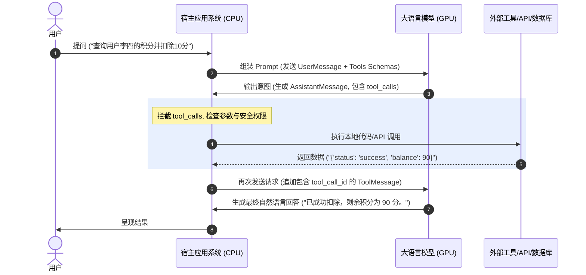

# Tool Calling (工具调用) 基础知识手册

本手册专门探讨智能体系统与外部环境交互的核心技术——**工具调用 (Tool Calling)**。涵盖了 Tool Calling 与 Function Calling 的底层区别、决策机制、Schema 设计规范，以及涵盖安全管控、参数校验、幂等限流、防循环调用和隔离沙箱设计（文件/Shell/数据库）的工业级工程防护手段。

---

## 📋 目录
- [一、 Tool Calling 机制与交互闭环 (Q1-Q6)](#一-tool-calling-机制与交互闭环-q1-q6)
- [二、 Schema 设计与校验规范 (Q7-Q11)](#二-schema-设计与校验规范-q7-q11)
- [三、 工业级工具调用安全控制 (Q12-Q20)](#三-工业级工具调用安全控制-q12-q20)
- [四、 乱调/漏调/死循环预防与沙箱工具设计 (Q21-Q30)](#四-乱调漏调死循环预防与沙箱工具设计-q21-q30)

---

## 一、 Tool Calling 机制与交互闭环 (Q1-Q6)

### Q1: Tool Calling 是什么？
**Tool Calling (工具调用)** 是一种赋予大语言模型（LLM）与外部世界（数据库、本地文件系统、第三方 API）进行数据交互的能力。
在 prompt 中，应用层向模型提供一组可用工具的结构化描述（Schema）。LLM 根据用户的输入，自主决定是否需要使用外部工具。如果需要，模型不会直接生成答案，而是输出一个**结构化的调用意图（如包含工具名和参数的 JSON）**。宿主系统截获该意图，执行对应的本地代码或调用外部接口，并把返回的结果喂回给模型，由模型最终推理合成回答。

---

### Q2: Function Calling 是什么？
**Function Calling (函数调用)** 是 Tool Calling 的一种特例与前身，最早由 OpenAI 在 2023 年中引入。它主要指大模型能够将用户的口语化输入，精准翻译并映射为代码中某一个具体函数的强类型参数对象（JSON 格式），使用户能直接在后台调用该函数。

---

### Q3: Tool Calling 和 Function Calling 有什么区别？
1. **多任务并发支持（Parallel Tool Calling）**：在旧版 Function Calling 时代，LLM 每次推理只能生成一个函数调用。而最新的 Tool Calling 标准（如 OpenAI 提供的 `tools` 字段及 `tool_calls` 消息类型）支持在单次回复中同时输出多个工具的调用意图（如“同时查询北京和上海的天气”），各调用带有唯一的 `tool_call_id`。
2. **多通道扩展性**：Function Calling 局限于调用代码中的自定义函数（`function` 类型）。而 Tool Calling 作为一个更泛化的系统协议，未来可直接接入模型原生的 `web_search`、`code_interpreter`（模型内置的代码解释器沙箱）等不同类型的工具通道。

---

### Q4: LLM 是如何决定调用哪个工具的？
LLM 决定调用哪个工具并不是通过代码里的“if-else”逻辑，而是纯粹依靠**语义对齐（Semantic Alignment）与指令遵循（Instruction Following）**：
1. **提示词包装**：宿主系统将工具的 Schema 翻译成特定的 JSON 格式，在模型输入前以 System Prompt 或特定的 API 接口参数拼装送给 LLM。
2. **描述性召回**：LLM 阅读用户的提问，通过自注意力机制（Self-Attention）将提问的意图与各个工具 Schema 中的 `description`（描述信息）和参数描述进行语义匹配。
3. **结构化生成**：一旦语义空间高度匹配，模型在微调阶段（SFT）学到的特殊 token 就会被触发，从而引导其输出格式化的 JSON 字符串（指明工具名称与参数填充）而非普通的聊天文本。

---

### Q5: LLM 会不会真正执行工具？
**绝对不会。**
大模型仅负责“生成要调用什么工具以及需要传入什么参数的 **JSON 格式意图文本**”。模型本身运行在 GPU 计算资源上，它没有任何网络访问权、操作系统 shell 权限或数据库驱动。真正的工具执行动作（如发送 HTTP 请求、运行 Docker 容器、执行 SQL 语句）**必须由包裹大模型的外部宿主应用程序（Host Application）在 CPU 服务器上运行完成。**

---

### Q6: 工具执行结果如何返回给模型？
工具调用是一套完整的消息闭环，通常包括以下交互流程：



---

## 二、 Schema 设计与校验规范 (Q7-Q11)

### Q7: 工具 schema 应该怎么设计？
使用严格的 **JSON Schema** 规范来描述。必须包含以下核心键：
- `name`：工具标识名，尽量采用蛇形命名（如 `query_database_record`），语义需清晰。
- `description`：工具功能的高质量自然语言描述。**这是 LLM 决定是否调用该工具的唯一语义媒介**。
- `parameters`：参数对象定义，包括参数类型（`type`）、参数说明（`description`）、是否必填（`required` 列表）以及可选的枚举值范围（`enum`）。

##### 📝 工具 Schema JSON 示例：
```json
{
  "type": "function",
  "function": {
    "name": "send_email",
    "description": "Send an email to a specified recipient. Use this tool only when the user explicitly requests sending an email.",
    "parameters": {
      "type": "object",
      "properties": {
        "to_email": {
          "type": "string",
          "description": "The recipient's email address, e.g., 'user@example.com'."
        },
        "subject": {
          "type": "string",
          "description": "The subject line of the email."
        }
      },
      "required": ["to_email", "subject"]
    }
  }
}
```

---

### Q8: 工具 description 应该怎么写？
- **精准度量边界**：清晰说明“该工具是做什么的、什么时候该用、什么时候**绝对不能**用”。
- **指示输入规范**：例如，“*当用户想要查询天气时调用该工具。输入参数 city 必须是标准拼音，例如 'beijing'，不能使用中文名称*”。
- **说明返回值含义**：例如，“*成功后返回一个包含状态码和平衡数据的 JSON 字符串*”。

---

### Q9: 工具参数如何设计？
- **参数扁平化设计**：尽量使用 `string`、`integer`、`boolean`、`number` 等基础扁平类型。**极力避免在参数中定义深度嵌套的对象或复杂的二维数组**，因为这会成倍增加大模型输出不合规 JSON 结构的概率，导致参数解析失败。
- **附带参数约束说明**：在各参数描述中，务必提供清晰的格式说明、量纲单位（如“以米为单位，而非千米”）以及有效的默认值。

---

### Q10: 工具返回值如何设计？
- **返回值字符串化**：工具的输出最终需要拼入 Prompt 中，因此返回值必须是易读的字符串。如果工具输出结构化数据，推荐转换为**精简的 JSON 字符串**。
- **内容截断与瘦身**：不要把整个大文本（如上万行的 raw html 或完整的 log 文件）塞回给模型。应该在工具端先进行核心数据提取（如只提取报错的那三行堆栈），防止模型上下文溢出。

---

### Q11: 工具错误如何设计？
- **禁止在执行代码中让程序直接崩溃（Crash）**。
- **返回可读的错误说明（User-friendly Errors）**：
  若工具执行抛出异常（如 `FileNotFoundError`），应在本地捕获异常，并将其封装为一条包含具体原因的错误消息，写入 `ToolMessage` 发送回大模型。例如：
  `"Error: Code compilation failed. Line 12: SyntaxError: invalid syntax. Please fix the code and try again."`
  这样能**赋予大模型自我反思与自愈纠错的能力**，使其在下一轮循环中自动调整参数重新调用。

---

## 三、 工业级工具调用安全控制 (Q12-Q20)

> [!WARNING]
> 大模型生成的工具参数具有高度不确定性，**绝对不能**直接将其传给底层系统执行。生产级 Agent 必须引入严密的安全防护盾。

### Q12: 工具调用如何做参数校验？
- **实现方案**：在工具分发器（Tool Executor）接收到参数后，立刻通过强类型的校验框架进行硬性拦截。
- **示例代码 (Pydantic 校验)**：
  ```python
  from pydantic import BaseModel, EmailStr, Field, ValidationError

  # 定义工具在 Python 端的强类型参数结构
  class SendEmailInput(BaseModel):
      to_email: EmailStr = Field(description="必须是合法的邮箱格式")
      subject: str = Field(min_length=1, max_length=100)

  def execute_send_email_tool(arguments_json_from_llm: str):
      try:
          # 使用 Pydantic 进行严格解析与类型转换
          args = SendEmailInput.model_validate_json(arguments_json_from_llm)
          # 验证通过，执行真实业务逻辑
          return run_send_email(args.to_email, args.subject)
      except ValidationError as e:
          # 拦截错误并安全上报给大模型
          return f"Error: Invalid tool arguments. Details: {e.errors()}"
  ```

---

### Q13: 工具调用如何做权限校验？
- **最小特权原则（POLP）**：
  在工具被真正触发前，从当前的用户会话（Session Context）中解析该用户的角色和标识符。
- **前置权限控制（ACL）**：
  工具执行器执行匹配：`can_user_run_tool(user_id, tool_name)`。如果普通用户试图调用 `delete_file` 这样的管理员专属写工具，直接在本地阻断，向模型返回 `"Error: Permission Denied. You do not have privilege to execute this tool."`，防止垂直越权。

---

### Q14: 工具调用如何做超时控制？
- **实现方案**：对每个工具的执行代码，使用异步任务包或者线程超时机制强行设置 Hard Timeout（例如网络调用限时 5 秒）。
- **目的**：若工具调用发生死锁或三方接口卡死，超时拦截器能立刻回收线程并返回 `"Error: Tool execution timeout."`，防止整个 Agent 阻塞挂起。

---

### Q15: 工具调用如何做重试？
- 仅针对**可恢复的瞬时网络波动或并发限制（如 HTTP 429/502/503）**进行重试。
- 在工具执行内部使用 `tenacity` 等库进行指数退避（Exponential Backoff）重试，对大模型隐蔽这一重试过程，只有在数次内部重试全部失败后，才将错误上报模型。

---

### Q16: 工具调用如何做幂等？
- 对于支付、建单等写操作，以模型生成的 `tool_call_id` 或基于当前会话状态特征（如 `user_id` + 时间窗口）计算 Hash，作为底层系统的**幂等键（Idempotency Key）**传递给业务后端。
- 业务后端通过 Redis/数据库对幂等键做唯一性校验，确保由于网络抖动引发的重试不会造成重复付款或重复创建记录。

---

### Q17: 工具调用如何做限流？
- 根据发起用户的 IP、会话 Token 对工具调用接口进行限流（Rate Limiting）。
- 设定每分钟最大调用频次。超出阈值后，限流拦截器直接拒绝工具运行并返回限流提示，防止 Agent 陷入死循环后疯狂请求外部第三方服务产生巨额扣费或触发外部系统风控。

---

### Q18: 工具调用如何做审计？
- **全面可追溯性**：
  在日志系统或专门的审计库中记录每一次工具调用的快照：
  `[时间戳] [用户ID] [ToolCallID] [工具名称] [传入JSON参数] [执行耗时] [返回结果/报错信息]`
  这是事故追责、合规性审查以及复现并排除大模型 Bug 的重要依据。

---

### Q19: 工具调用如何做人工确认？
- **中断审批流（Human-in-the-loop Gate）**：
  1. 执行器判定将调用的工具在“敏感名单”中。
  2. 执行器暂停当前图/流程的向前推进，将工具调用请求写入一个待审核任务队列，状态保存为 `Pending`。
  3. 前端 UI 弹出人类确认框，展示大模型企图执行的动作及参数。
  4. 人类点击“批准”，流程恢复并下发命令执行；若点击“拒绝”，向模型返回 `"Error: Operation rejected by supervisor."`。

---

### Q20: 工具调用失败后 Agent 应该继续还是终止？
根据错误的致命等级（Fatal Grade）采取不同的控制流走向：
1. **非致命错误（Non-fatal Errors，如参数格式错、找不到文件、连接网络抖动）**：
   - 策略：将可读的错误原因返回给模型，**允许 Agent 继续循环**。LLM 会利用其自省能力，重新修正参数尝试调用。
2. **致命错误（Fatal Errors，如无权操作、API余额耗尽、数据库崩溃）**：
   - 策略：此种错误即便重试多次也毫无可能修复，**必须立即触发熔断**，控制流跳出循环，流向 `ErrorNode`，安全退出并通知用户。

---

## 四、 乱调/漏调/死循环预防与沙箱工具设计 (Q21-Q30)

### Q21: 如何防止模型乱调工具？
1. **动态工具注册（Dynamic Context-aware Loading）**：不要一次性把成百上千个工具 Schema 塞给模型。应在前端根据用户的意图进行初步分类路由，**每次仅向大模型注入高度相关的 3-5 个工具**。
2. **设定严格的排他性 Prompt 边界**：在系统提示词中声明：“*你只在获取当前天气数据时使用 Weather 工具，其余任何时间禁止调用它。*”

---

### Q22: 如何防止模型漏调工具？
1. **完善 Schema 描述的互斥条件与前置依赖关系**：例如在 delete 工具描述里明确指出：“*在删除记录前，你必须先调用 get_record 确认记录 ID 真实存在*”。
2. **Few-Shot 指导**：提供 1-2 组多步工具调用连贯解决问题的 Few-shot 示例，供模型模仿学习。

---

### Q23: 如何防止模型重复调工具？
- **历史状态检查**：在 State 中保存已执行工具的滑窗历史。如果检测到模型在最近 3 次 Step 中，使用完全一致的入参去调用相同的工具（而工具返回的又是同样的值），说明模型陷入死区。
- **主动干预**：系统拦截该重复请求，强制改写 Tool 消息为：`"Notice: You have already run this tool with these arguments. Do not repeat. Please reason on the previous output."`。

---

### Q24: 如何防止模型陷入工具调用循环？
- **动作哈希滑动窗口**：利用滑动窗口保存近几步的工具调用 Hash 序列（如 `[ToolA_Hash, ToolB_Hash, ToolA_Hash]`）。
- **指纹循环检测**：如果发现动作指纹序列中出现明显的周期性闭环，调度器立刻触发熔断机制，主动终止循环，并将控制权交还给用户或报错节点。

---

### Q25: 如何限制最大工具调用次数？
- 在全局 State 中设置 `tool_call_count`，每触发一次工具调用，计数器自增 1。
- 设定硬上限（如最多 15 次）。达到后，调度器强行关闭 Tool Calling 通道，禁止大模型再获取任何工具返回，强制收拢进行结果生成或直接报错退出。

---

### Q26: 如何设计危险工具白名单？
- 明确划分工具等级：
  - **白名单工具（无需确认，全自动）**：均为只读操作（如 `read_file`, `grep_search`, `calculate`）。
  - **黑名单/风险工具（强制人工审核）**：包含所有写入、修改、删除和代码执行操作（如 `execute_shell`, `write_file`, `update_db`）。这些工具的执行入口在底层物理代码上绑定了中断审批器。

---

### Q27: 如何设计只读工具和写工具？
- **物理隔离架构**：
  - **只读工具（Read Tools）**：绑定受限的只读服务账户（例如数据库角色配置为 `db_datareader`，无 `INSERT`/`UPDATE`/`DELETE` 权限），只允许数据查询。
  - **写工具（Write Tools）**：绑定高权限账号，但运行在事务隔离环境中，且严格进行前置参数校验与人工审计审查。

---

### Q28: 如何设计文件读写工具？
- **Workspace Jail (工作区沙箱限制)**：
  1. 设定 Agent 允许操作的基准根目录（如 `jail_root = "/home/app/workspace"`）。
  2. 工具接收到 `filepath` 后，立刻使用 `os.path.realpath` 计算其物理绝对路径。
  3. **严格前缀检查**：
     ```python
     # 检查文件路径是否属于工作区，防范 ../ 越界访问任意系统文件 (目录遍历漏洞)
     if not os.path.abspath(target_path).startswith(os.path.abspath(jail_root)):
         return "Error: Path traversal detected. Access denied."
     ```

---

### Q29: 如何设计 shell 执行工具？
- **绝对禁止在本地宿主机直接运行大模型生成的 shell 指令（防 rm -rf / 与病毒注入）**。
- **沙箱化容器运行（Containerized Sandbox）**：
  1. 宿主系统接收到指令后，将指令打包，通过 Docker API 投递进一个完全隔离的、具有超短生命周期（如 30 秒）的 Docker 容器中。
  2. 容器限制 CPU 使用率、最大内存配额，且断开外网连接（或使用严格防篡改的内网代理）。
  3. 命令执行完毕后，抓取 stdout/stderr 输出，并自动**彻底销毁该 Docker 容器实例**。

---

### Q30: 如何设计数据库查询工具？
1. **禁止直接执行 LLM 拼装的原始 SQL 字符串（防止 SQL 注入与意外删表）**。
2. **方案 A：Schema 限定参数化查询**：只给模型暴露特定参数工具（如 `get_user_by_name(username: str)`），后端使用预编译的 SQL 占位符（Parameterized Queries）进行执行。
3. **方案 B：只读元数据绑定 + LIMIT 截断**：如果必须支持动态 SELECT 查询，确保大模型使用的连接角色仅拥有 `SELECT` 权限。并且在工具端，**强制拦截 SQL 文本，在尾部强行追加 `LIMIT 100;`**。这能防止模型误写全表扫描 SQL 导致核心数据库 CPU 爆满崩溃。